## PURCHASE MANAGEMENT - USERGUIDE FOR MAGENTO 1

### Introduction
Purchase management is always a headache to retailers. As the businesses grow up and upscale, they have to manage purchase orders among various suppliers and warehouses. On the other hand, without a well-organized process, so many staff involved in the purchase management will easily end up troublesome. With our Purchase management module, you’ll no longer worry about how to management PO the most efficiently. Here we provide you a step-by-step workflow to manage purchasing. You are guided through how to create quotation, how to create a purchase order at and how to receive or return items to finish purchase order. Especially, a detailed permission matrix will be available to show you all the possible user roles in each step of the process, which helps run a smooth internal operation.

Hopr that [Magento Purchase Order Management module](https://www.magestore.com/purchase-order-management) will help you streamline the purchasing workflow and maximize your profit.

### Workflow

### Permission Matrix

## Purchase Management Pocesssing
### Purchase Order
#### Purchase Staff Create Request for Quotation
*"A **quotation** (or a **request for quotation**) is the proposal of price and quantity of goods that store owners send to suppliers. The quotation will become purchase order when a seller sends confirmation of price and availability of products stated in the quotation.”*

To create a new request for quotation, purchase staff can follow this path: **Purchase Management > Quotationt > Create Quotation**

Then the page will be shown as below:
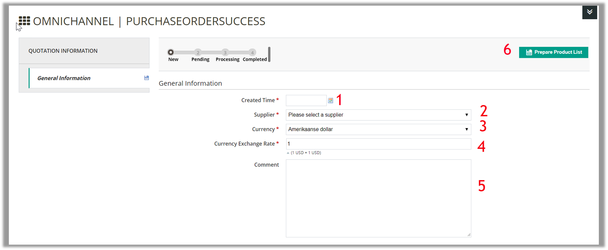

➢Step 1: **Fill in General Information tab** 
1. Choose Created Time 
2. Choose Supplier to ask for quotation 
3. Choose Currency  
4. Currency Exchange Rate 
5. Adding comments is optional 
6. Click on Prepare Product List for the next step. You will be navigated to this view:

➢Step 2: **Prepare product list** 
In this step, there are 6 ways for you to prepare product list: 
- Import products via a CSV file 
- Scan Barcode 
- Prepare product list based on supply need forecast 
- Prepare back sales products (Back sales products are ordered by - customers but not available in stock now) 
- Prepare low stock products 
- Prepare product list manually with **All Supplier Products** button 

Apart from importing products via a CSV file, you need to enter **Purchase Cost, Tax, Discount and Qty Ordering** for each product. Editing in line is allowed here. After entering all required fields, click on Save button and Order Totals is automatically calculated.

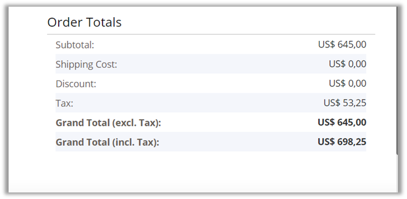

➢Step 3: **set up Shipping and Payment**

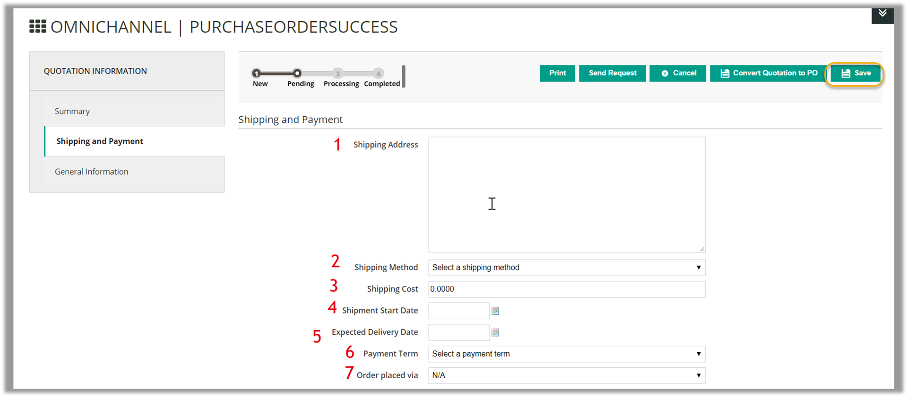

1) Enter the address you want the stock to be shipped to 
2) Select a shipping method for the quotation 
3) Estimate and enter the shipping cost 
4) Set start shipping date 
5) Set expected delivery date 
6) Select the payment term 
7) Choose the way to place order: N/A, Email, Phone, Fax, supplier website

After filling all the information, click **Save** to save all changes. You can still update products information by editing in a specific product line. Then, choose **Save** to create a request for quotation.

#### Purchase Manager Validates Request for Quotation
To validate a request for Quotation, purchase manager goes to **Purchase Management > Quotation**, choose **Quotation** to see quotation list. At the list of quotation, click on **View** at the quotation has status as “**pending**”.

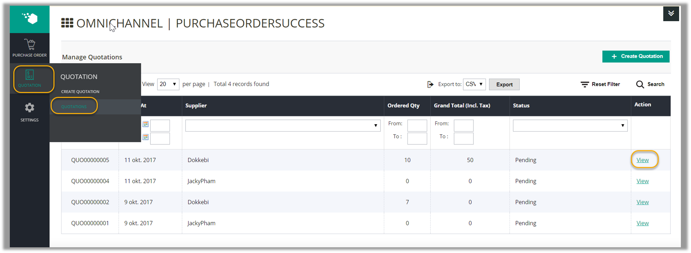

Then, the view will be shown as below:

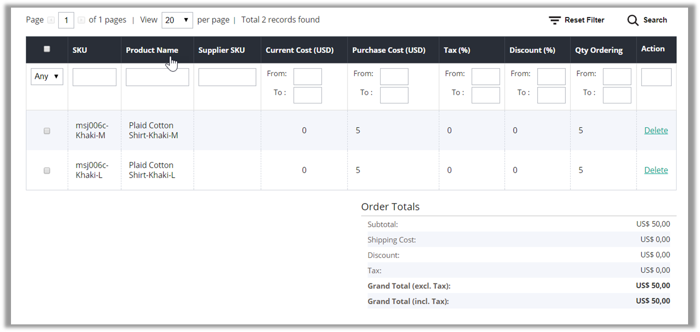

In this page, you are able to edit in **Summary** tab and **Shipping and Payment** tab. Choose each tab to edit directly in line. After finishing all edit, click **Save** to save your work. 
#### Purchase Staff Send Request for Quotation to Supplier
To send Request for Quotation to supplier, purchase staff goes to **Purchase Management > Quotation**, choose **Quotation** to see quotation list. At the list of quotation, click on **View** at the quotation has status as “**pending**”.

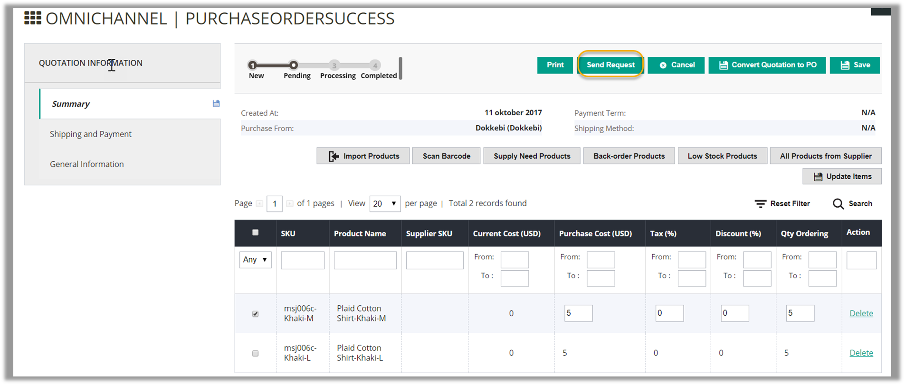

On this page, click on **Send Request**. The request for Quotation will be sent to supplier via the email in supplier information. 
#### Purchase Manager Approves Purchase Order
To approve Purchase order, purchase manager convert request for quotation to purchase order. In a Quotation view, click on **Convert Quotation to PO**.

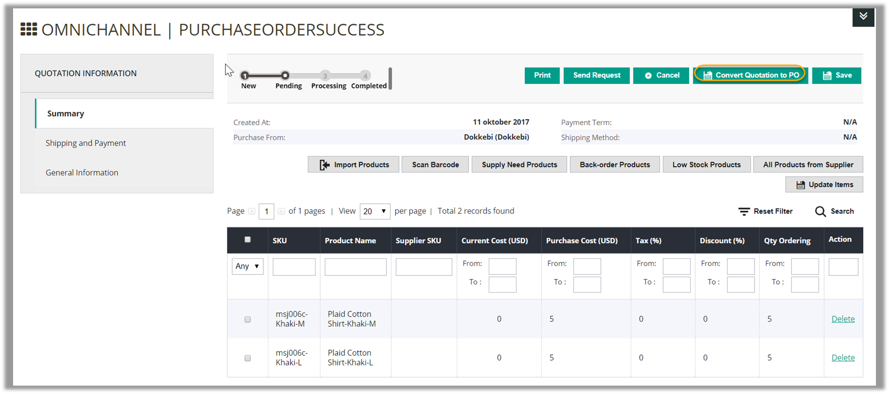

As the quotation is converted to purchase order, you will be navigated to **Purchase Order Information** page

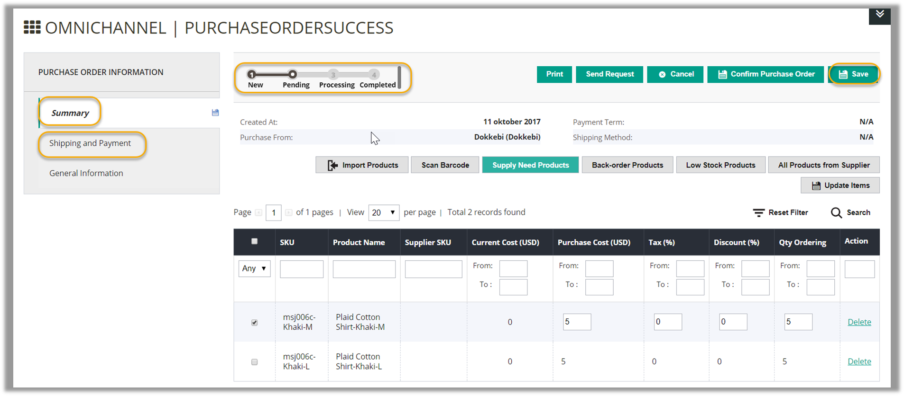

As can be seen, the purchase order is marked as “**pending**”. In this page, you are still able to update the product information as editing is allowed to be done directly in **Summary** tab and **Shipping and Payment** tab. After finishing all editing, click on **Save** to save all changes.
#### Purchase Manager Confirms Purchase Order
To confirm purchase order, purchase manager clicks on **Confirm Purchase Order** and the page will be shown as below: 

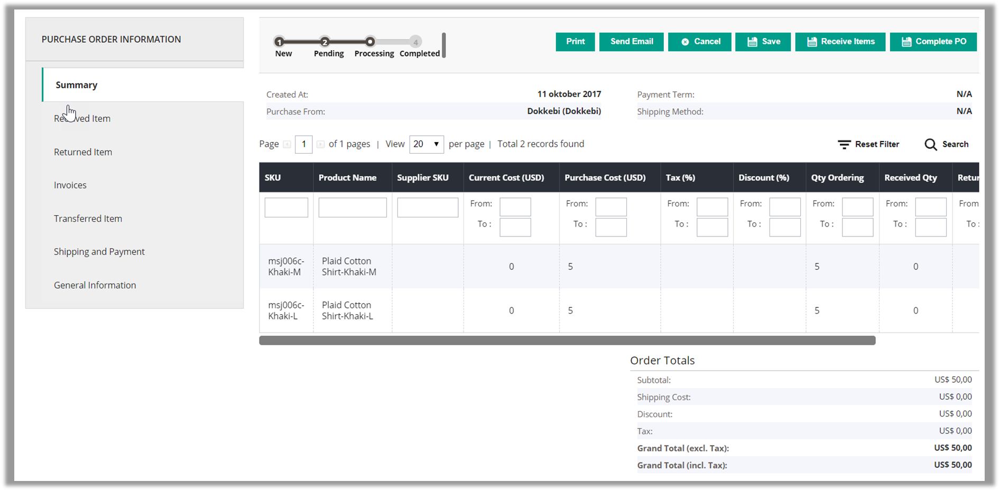

After being confirmed, the purchase order will be marked as “**processing**” and supplier will deliver products to store.
#### Purchase Staff Complete Purchase Order
To complete Purchase Order, purchase staff access these tabs as shown in the list here: 
- **Summary** tab
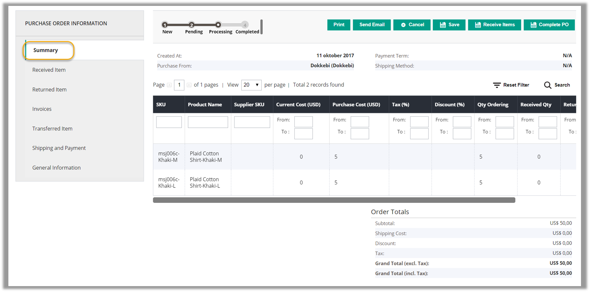

This tab displays all the information of the PO that you have entered in the previous steps. 

- **Received Items** tab:

This tab updates how many of each product in the PO you have received. You can mark all items as received, or manually do that for some products. If you have installed the Barcode Management module, you can also enter the product’s barcode and update its delivery status. 
- **Returned Items** tab:

This tab records all products in the PO which you have returned to the supplier. Please note that you can only return products which you have received.

A Return Items window will appear. Enter the date of return, select product(s) to be returned, type in the quantity to be returned and finish by clicking Return.
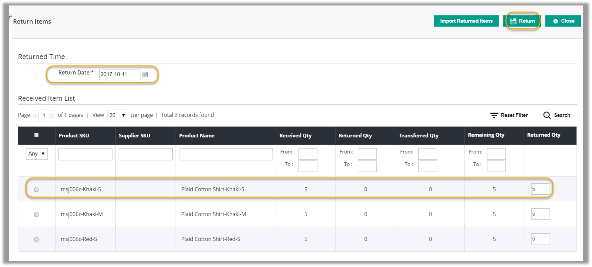

- **Invoice** tab:

This tab allows you to create invoice for the PO including payment and refund amount.
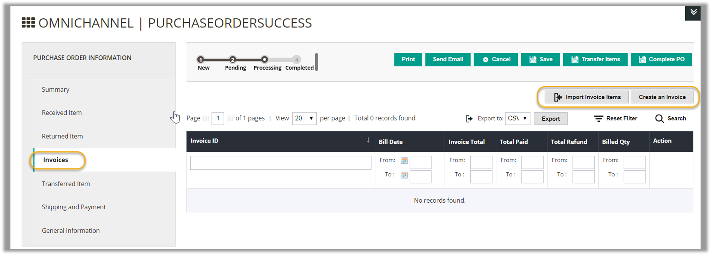

A **Create an Invoice** window will appear. Enter the date of creating the invoice; select product(s) to be invoiced; type in the quantity to be billed, unit price (if different), tax and discount in percentage and finish by clicking **Save**.

- **Transferred Items** tab:

transfers deliveries into a specific warehouse. Please note that you can only transfer products which you have received.

A **Transfer Items** window will appear. Enter the date of transferring; choose the warehouse to transfer products to; select product(s) to be transferred; type in the quantity to be transferred and finish by clicking Transfer.

- **Shipping and Payment** and **General Information** tabs

After finishing the first 4 tabs, checking information in the 2 last tabs before completing the Purchase Order 
    - **Shipping and Payment**: views and edits shipping and payment information for the PO which you may have input in creating the PO. 
    - **General Information**: displays the General Information that you input when creating the PO. 
- **Complete Purchase Order**

During the process of Confirm Purchase Order, you can complete the purchase order any time by clicking the **Complete PO** button at the right of the page. You can also **Print**, **Send Email**, **Cancel** or **Save** the PO during the process.

You can complete a purchase order even when you have not received all requested items. When the purchase order status is completed, you cannot receive items anymore but you can still transfer received items into warehouses by clicking on **Transfer Items**

-----------------------------
**_Confidential Information Notice_** 

Copyright 2017. All Rights Reserved. Any unauthorized reproduction of this document is prohibited. 

This document and the information it contains constitute a trade secret of Magestore and may not be reproduced or disclosed to non-authorized users without the prior written permission from Magestore. Permitted reproductions, in whole or in part, shall bear this notice.

