# BARCODE MANAGEMENT - USER GUIDE FOR MAGENTO 1

**Version 1.0**

-------------

## INTRODUCTION

Barcode by definition is the small image of lines (bars) and spaces that is affixed to retail store items, identification cards, and postal mail to identify a particular product number, person, or location. The code uses a sequence of vertical bars and spaces to represent numbers and other symbols. Barcode is a reliable method for cutting costs and savingtime for business.

Barcode management module from Magestore provides your business with a handful solution to generate barcode, print barcode label and scan barcode, all in one.

[Magento Barcode Management](https://www.magestore.com/barcode-management) is one module in our [Omnichannel solution](https://www.magestore.com/omnichannel-retail) for Magento retailers.

-------------

## HOW IT WORKS

### Barcode listing

Barcode listing is a view to display all barcodes of all products saved in Inventory Management. It contains Barcode, SKU, Supplier and Purchased Time.

From this screen, admin can instantly take actions like importing or generating barcode with 5 buttons on the top right.

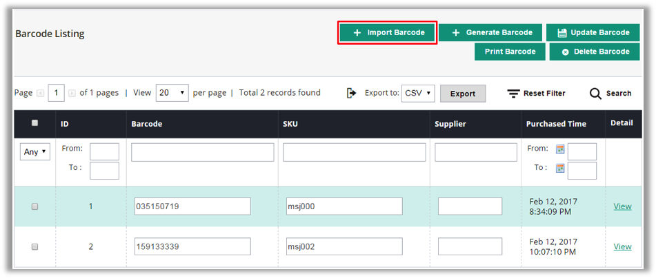

Admin can also view details of each product and barcode. 

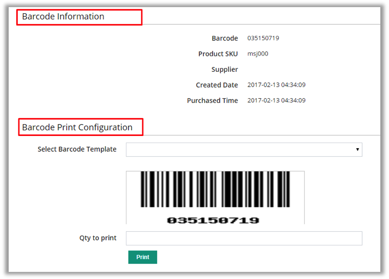

From barcode detailed page, admin can configure barcode printing and print barcode directly. Product information is shown including Image, name, price and its availability in each warehouse.

###  Generate barcode

Inventory Management gives you 2 modes to generate barcode:

- One barcode per product SKU
- Multiple barcodes per product SKU
This can be configured in Barcode Settings.

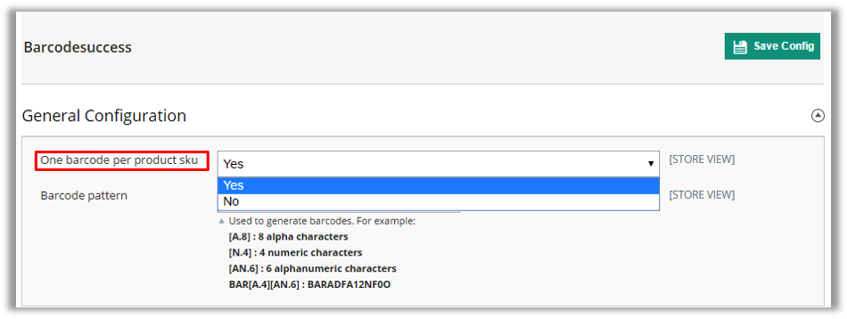

- If you set “One barcode per product SKU” as “Yes”, then the system will allow you to generate only one barcode for one product SKU.
Now to generate barcode, you go to Generate Barcodes tab. From here you can select the product that you want to generate barcode, fill in the Supplier (optional) then generate.

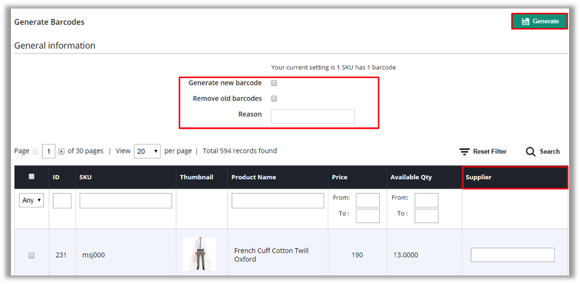

If you set “One barcode per product SKU” as “No”, then it opens up 2 options to generate barcode when you go to Generate Barcodes tab.

- Generate Barcode

These 2 options are: Generate barcode per item or Generate barcode per purchase.
“Generate barcode per item” means each item will have its own identified barcode although they have the same SKU.

“Generate barcode per purchase” means items will be identified by the time it is purchased. Although you take 10 items with same SKU in one time purchasing from supplier, these 10 items will have the same barcode. But in another time of purchase, they will have different barcode.

After selecting the option you want to proceed with, you can continue selecting product, fill the product Qty., supplier and purchased time (optional) then generate. 

Admin can configure the barcode pattern to generate. Barcodes generated will be saved in Barcode listing page &amp; Barcode creating history.

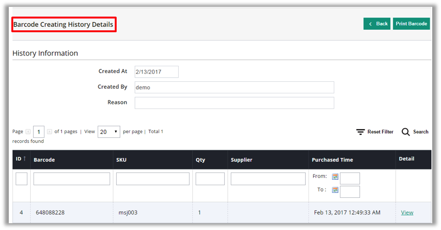

### Import barcode

When you generate barcodes in mass, you will not need to use Generate barcode feature. Instead, you can import barcode directly into the system using the **Import barcode** feature of Inventory Management.

The system provides a sample import file including SKU, Barcode, Qty. and Supplier &amp; Purchase time (optional).

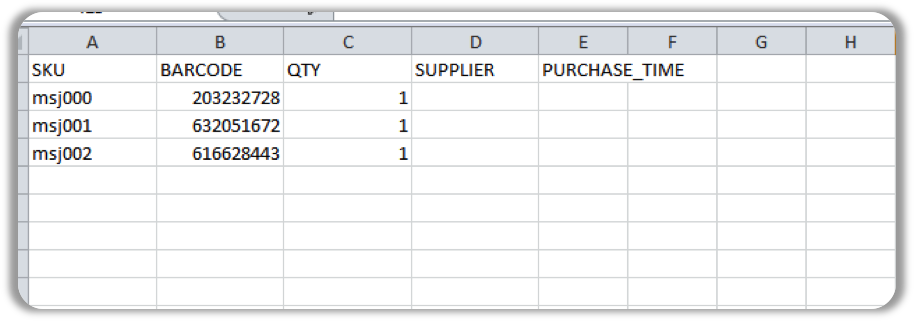

After preparing the file as in the sample file, now you can upload the file, fill the reason and start to import.

### Barcode label template

You can create your own barcode template by adding new template. There are also 3 most used templates as default templates: **A4**, **Jewelry** and **Standard** for you to select.

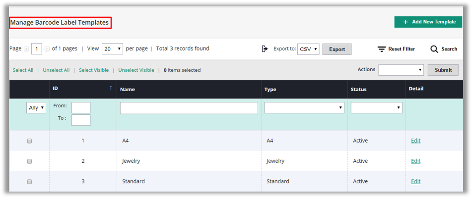

You can configure paper width and height, label width and height, font size…and preview the template before saving. 

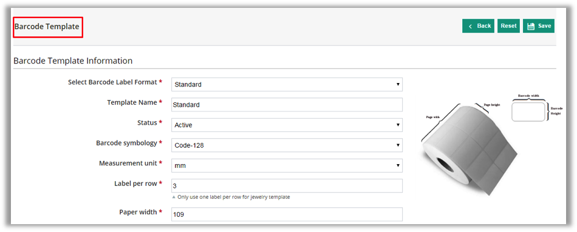

### Print barcode

In Barcode configuration, admin can select the barcode template from the templates created before to print. 

Admin can select multiple barcodes to print at once. Or click to **View** under Action column to print one barcode multiple times.

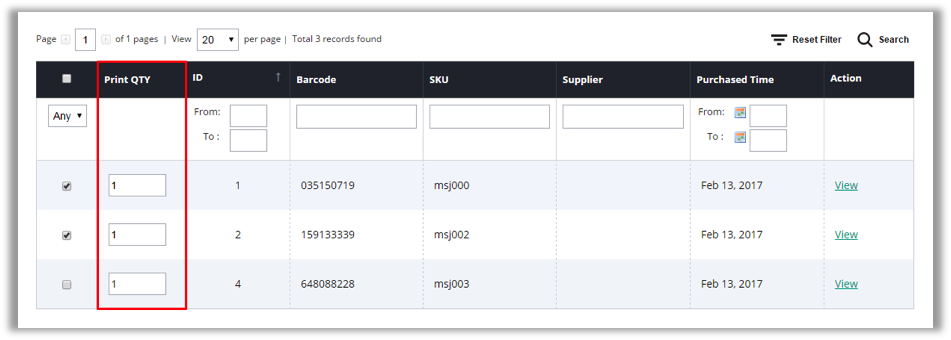

### Scan barcode

In our inventory management modules, you need to use a Barcode scanner which is able to connect with your computer. Then you can scan to read product information or update stock Qty. when doing Stock taking (Stock taking is a function available in Magestore's inventory management solution) or managing purchase orders.

- When going to Scan Barcode, you can read barcode information and product information.

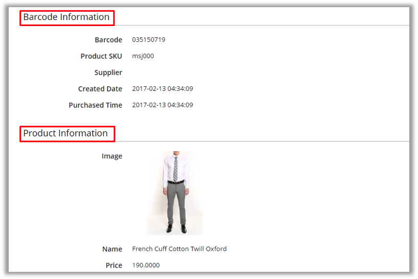

- In Stock-taking, there are 5 steps: *1- General information*, *2-Prepare products*, *3-Stock counting*, *4-Complete data entry*, *5-Complete Stocktaking*. You can scan barcode to choose products in step 2-Prepare products and count stock quantity in step 3-Stock counting. (For more details of Physical Stock taking, please refer to Inventory Management user guide.)

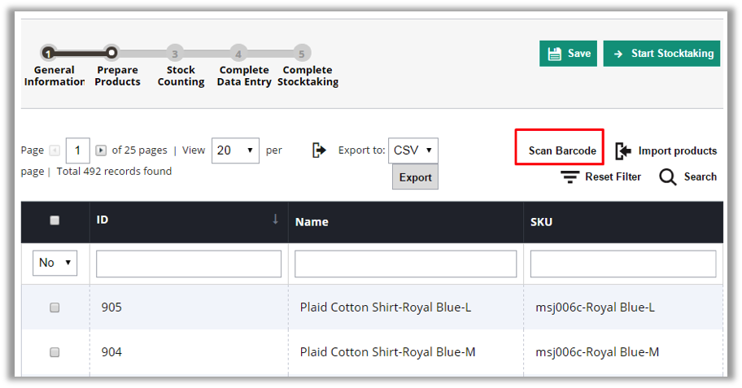

-------
**_Confidential Information Notice_**

Copyright 2017. All Rights Reserved. Any unauthorized reproduction of this document is prohibited. 

This document and the information it contains constitute a trade secret of Magestore and may not be reproduced or disclosed to non-authorized users without the prior written permission from Magestore. Permitted reproductions, in whole or in part, shall bear this notice.
