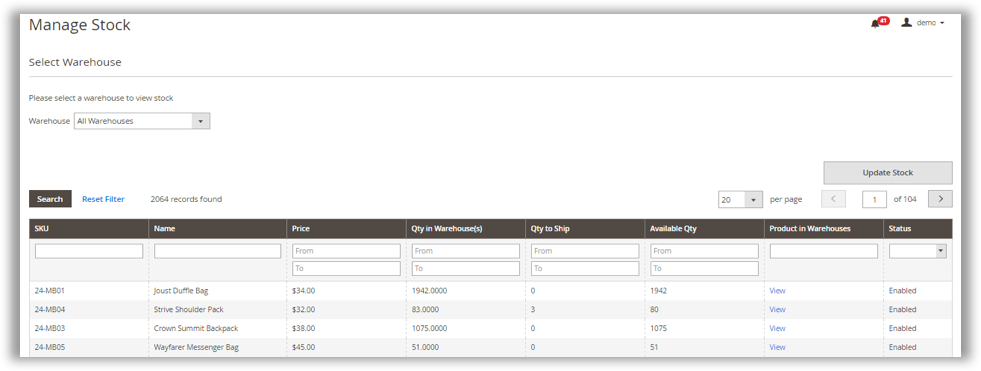
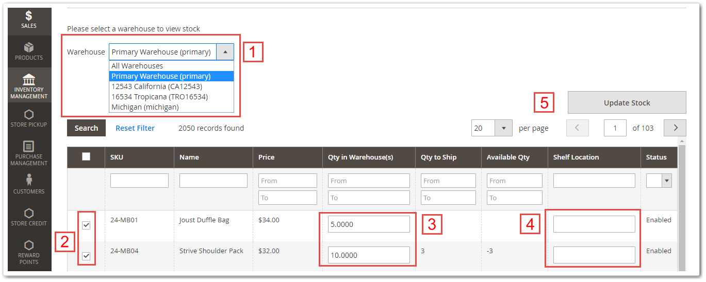
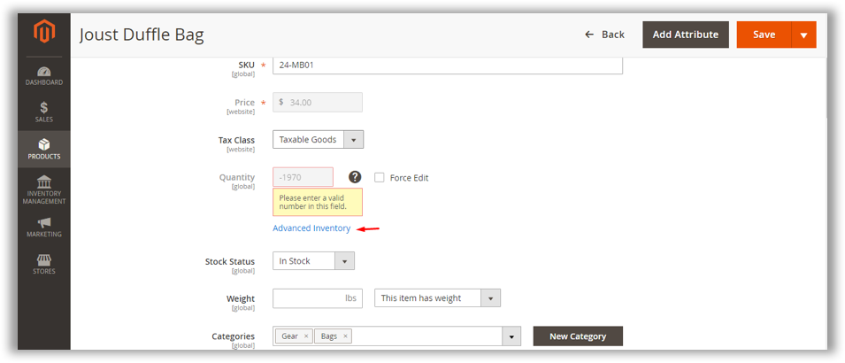
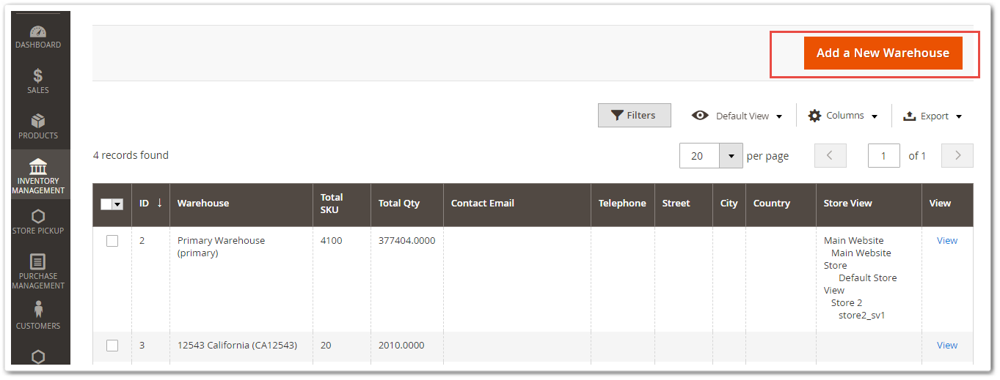
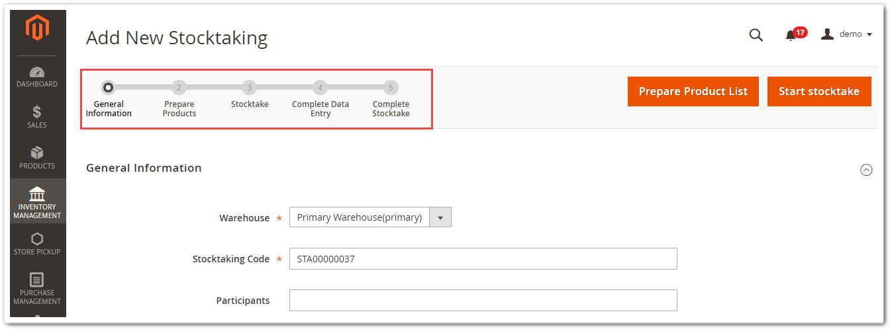

# MULTI-WAREHOUSE INVENTORY MANAGEMENT- MAGENTO 2

------

## INTRODUCTION

If your inventory is not enough to supply, you may lose customer. But if the inventory you keep is more than needed, it will cost you lots of money to manage. Thus, it is vital to equip your business with an effective inventory system to always keep your warehouses at an ideal stock level. Magestore team has been working hard to offer you a friendly & affordable stock management solution for Magento 2 with smart design, clean and simple workflow to handle every activity about stock management, stock transfer, stock taking and low stock notification…in your warehouses in the most efficient way. 

[Magento Multi-warehouse Management](https://www.magestore.com/multi-warehouse) is one module in our [Omnichannel solution](https://www.magestore.com/omnichannel-retail) for Magento retailers.

---
## HOW TO CONFIGURE
### Stock Control Configuration

- *Path*: **Stock Management > Settings** section > **Configuration** 

(1)	**Link stocks in Warehouse to Front Store View:** choose **Yes** to activate the visibility of Stocks in Warehouse on the Front Store View

(2)	**Adjust Stock by entering the change Qty:** 

-  If you choose **Yes**, when you enter the difference quantity (either a positive or negative figure), the system will calculate the final balance in warehouse by adding/ subtracting the entered value.
- 	If you choose **No**, you need to enter the exact quantity of stock in warehouse and the system will recognize this figure as the latest available quantity of product.

(3)	Click **Save Config** to finish

### Inventory Option
- *Path*: **Stock Management > Settings** section **> Configuration > Catalog > Inventory** 

***Note***: *If you want to configure based on your own features, then unmark box **Use System value.*** 

#### Stock Option
- *Path*: **Stock Management > Settings** section **> Configuration > Catalog > Inventory** 

(1)	**Decrease Stock When Order is Placed:** Select **Yes** in the dropdown list to adjust the quantity on hand when an order is placed.

(2)	**Set Items’ Status to be In Stock When Order is Cancelled**: Select **Yes** in the dropdown list to return items to stock if an order is cancelled.

(3)	**Display Out of Stock Products:** Select **Yes** in the dropdown list to continue to display products in the catalogue that are no longer in stock. 

(4)	**Only X left Threshold:** Enter the number in the blank to display the message: **Only x left** on website when the quantity in stock reaches the threshold.  

(5)	**Display Products Availability in Stock on Storefront:** Select **Yes** in dropdown list to display an **In Stock** or **Out of Stock** message on the product page.

(6)	Tap **Save** to finish. 

#### Product Stock Options
- *Path*: **Stock Management > Settings** section **> Configuration > Catalog > Inventory** 

(1)	**Manage Stock:** Select **Yes** to activate inventory control for your catalog. 

(2)	**Backorders:** Set Backorders to one of the following status: 
- **No Backorders Allow Qty. Below 0:** To reject backorders when product is out of stock.
- **Allow Qty. Below 0:** To accept backorders when the quantity falls below zero. 
- **Notify Customer:** To accept backorders when the quantity falls below zero, and notify the customer that the order can still be placed.

(3)	**Maximum Qty Allowed in Shopping Cart**: Enter the **Maximum Qty.** allowed in Shopping Cart.

(4)	**Out-of-Stock Threshold**: Enter the quantity for Item's Status to become out of stock.

(5)	**Maximum Qty Allowed in Shopping Cart**: Enter the **Minimum** quantity allowed in Shopping Cart.

Next, 

(6)	**Notify for Quantity Below**: Enter the stock level that generates notification showing the item is out of stock.

(7)	**Enable Qty Increments**: Select **Yes** to activate quantity increments for the product. Then in the **Qty. Increments** field, enter the number of the items that must be purchased to meet the requirement mentioned above.

(8)	**Automatically Return Credit Memo Item to Stock**: Select **Yes** to return the item to inventory by default when a credit memo is issued for the item.

Finally, click on **Save Config** to save changes.

### Low Stock Notification Rules 
Please refer to section **Low Stock Rules** 

## HOW IT WORKS

### Stock listing

#### Stocks in Warehouse

Path: **Inventory Management > Stock Listing** section **> Stocks in Warehouse**

This page provides an overview of stock data in all warehouses and admin can select a warehouse to view stocks of that warehouse only.

It can show **Available Qty**, **Qty to Ship** and **Total Qty** in each warehouse and **Shelf Location** of that product in the warehouse.

After **selecting a specific warehouse**, admin can easily update stock and shelf location right on the Inventory grid just by:

(1)	Mark the checkbox to select products
(2)	**Qty in Warehouse**: Edit product quantity in line
(3)	**Shelf Location**: Input the product’s Shelf location (optional)
(4)	Click on **Update Stock** to save changes

#### Non-warehouse Products

Path: **Inventory Management > Stock Listing** section **> Non-Warehouse Products**

When a product is newly created and not assigned to any warehouse yet, it will be automatically allocated in Non-warehouse. From here admin can assign this product to any warehouses. 

(1)	Select the product by clicking on the checkbox
(2)	**Add to Warehouse**: Add it into warehouse by clicking on its Add to Warehouse column.

#### Warehouse

After installing, the system will automatically provide a **Primary Warehouse**. This warehouse cannot be deleted and can only be edited. All the existing products with stocks level of your website will be automatically allocated in this warehouse first before being sent to other warehouses.

##### Add a New Warehouse
Path: **Inventory Management > Stock Listing** section **> Warehouses**

A warehouse contains basic information including Total SKU, total Qty, contact email, telephone, street, city, country and status

Admin can **Add New Warehouse** then fill all information including warehouse name, contact, country…

##### View Warehouse's detail information
Path: **Inventory Management > Stock Listing** section **> Warehouses**
 
 (Ảnh)

(1)	Tick on the checkbox to choose a warehouse

(2)	Click on **View** to the warehouse detailed information

(Ảnh)

In the **View Warehouse page**, there are 6 tabs to manage the warehouse. On the right side of each master data tab, click on the **Arrow button** to access the data:

(1) **General Information**: Information of the Warehouse including Name, Code, address, etc

(2) **Stock On-hand**: the total number of goods that are available in the warehouse in real time. Here, you can update each product's **Qty in Warehouse(s)** and its **Shelf Location** in-line.

(3) **Stock Movement**: all the changes in stock quantities. Click on each record to view in detail.

(4) **Order**:  records of all orders including status, order ID, purchase date, customer that the order has been billed-to/shipped-to, order value.

(5) **Warehouse Permission** manages staff access to the warehouse. Detailed guide is given in the next section ***Warehouse permissions***

(6) **Dashboard** contains reports that are illustrated as table and lines diagrams as below.

(ANh)
(Anh)

###### Warehouse permission
Path: **Inventory Management > Stock Listing** section **> Warehouses > Warehouse Permissions**

In this section, Admin can give different warehouse access permissions to different (admin) users.
Click on **View** to see the warehouse’s detail information

(Anh)

(1)	On the right hand side of the  **Warehouse Permission** tab, click on **Assign Staff** to give different warehouse access permissions.

Then will be a new pop-up screen shown as below:

(Anh)

Select Staff users to assign permission

(1) Select Staff by marking the checkbox

(2) Click on **Filters** to search Staff information (if any)

(3) Click on **Add Selected Staff**

(Anh)

(4) Then click on **Save Staff Permissions**

### Transfer Stock

#### Send stock & Request stock internally

##### **Send stock:** 

Path: **Inventory Management > Transfer Stock** section **> Send Stock**

If admin want to send stock from his warehouse to another warehouse, he can use this feature to record stock sending. 

The process to Send stock is: *Add new send stock > Prepare Product list > Select Products > Start Send Stock > Save Receive Stock > Mark as Completed*

-	**Step 1: Add new send stock** 

(ANh)

(1)	Fill the **Transfer Code** 

(2)	Choose **Source Warehouse** 

(3)	Choose **Destination Warehouse**

(4)	Fill in the **Reason** box

-	**Step 2: Prepare the product list** 

(anh)
To prepare product list, click on the **Prepare Product List** button

(ANh)

Here you have 3 options to prepare products to be sent:
--  **Scan barcode**: if you have our barcode management module installed;
--  **Select Products**: from the full list of your inventory;
--  **Import**: via a CSV file (with a provided sample).

**If you choose Select Products:**

(Anh)
(1) Click on the product needed

(2) Then, click on **Add Selected Products** button

(Anh)

(3) Choose the quantity to transfer and click on **Start Send Stock**

(4) You can click on **Remove** to delete product line

The system will dislpay a notification when the transfer is completed.

-	**Step 3: Receive stock:** Destination warehouse can create receives by either **importing** via a CSV file or **selecting products** from the list of Sent products.

(Anh)

If you click on **Select Products** in **Receiving history** tab:

(Anh)

(1)	Select the product to receive 

(2)	Click on **Add Selected Products**

(Anh)

Enter the quantity received in receiving history

(Anh)

Click on **Save Receive** and the system will display a notification about the Successful Receipt

You can also view and download the **Shortfall List** – the list containing the products that the Destination warehouse does not receive from Source warehouse:

(Anh)

Or **Return products**, also on the same page:

(Anh)

##### **Request Stock:** 

Path: **Inventory Management > Transfer Stock** section **> Request Stock**

If a warehouse lacks of stock, admin can create a Stock request to get stock from other warehouse. The process to request stock is: *Add new request stock > Prepare Product list > Select Products> Start Request Stock > Save Delivery Stock > Save Receive Stock > Mark as Completed*

-	**Step 1: Add new request stock** 

(ANh)

(1)	Fill the **Transfer Code** 

(2)	Choose **Source Warehouse** 

(3)	Choose **Destination Warehouse**

(4)	Fill in the **Reason** box

-	**Step 2: Prepare the product list** 

(anh)
To prepare product list, click on the **Prepare Product List** button

(ANh)

Here you have 3 options to prepare products to be sent:
--  **Scan barcode**: if you have our barcode management module installed;
--  **Select Products**: from the full list of your inventory;
--  **Import**: via a CSV file (with a provided sample).

**If you choose Select Products:**

(Anh)
(1) Click on the product needed

(2) Then, click on **Add Selected Products** button

(Anh)

(3) Enter the quantity to transfer 

(4) Click on **Start Request Stock** *

You can click on **Remove** to delete product line

The system will dislpay a notification when the transfer is completed.

-	**Step 3: Delivery History:** Source warehouse when receives the stock request can create a stock delivery. When a stock delivery is created, stock will be subtracted immediately from the source warehouse.

(Anh)

You can either import products via a CSV file or click on **Select Products** in delivery history.

**If you choose to Select Products**

(Anh)

(1)	Select the products to added

(2)	Click on **Add Selected Products**

(Anh)

Enter the quantity received in delivery history àn click on **Save Delivety**

-	**Step 4: Receive History:** Destination warehouse can create receives by importing or selecting product then update received qty. 

(Anh)

Click on **Select Products** in receiving history

(Anh)

(1) Select the products to receive

(2) Click on **Add Selected Products**

(Anh)

Enter the quantity received in receiving history and click on **Save Receive**.
The system will display a message when the receiving is created successfully. 

After that, stock will be added immediately to the destination warehouse from which the stock request was sent.

You can also download **Shortfall List & Summary** of the Stock Request.

#### Transfer to External & Transfer from External 

- **Transfer to External**

Path: **Inventory Management > Transfer Stock** section **> Transfer to External**

This feature allows you to record sending the product to an external destination e.g. when the product is damaged, loss or sent as free gift…

(Anh)

(1) Fill the **Transfer Code**

(2) Fill the **External Location**

(3) Choose **Warehouse**

(4) Fill Notifer Emails

(5) Fill in the **Reason** box

(6) Click on **Prepare Product List**

(Anh)

Then, you can add or import products to transfer stock by clicking on **Scan Barcode, Import** or **Select Products**.

If you choose to **Select Products** from your inventory:

(Anh)

(1)	Select the products to be added

(2)	Click on **Add Selected Products**

(Anh)

Fill the **Qty** and click on **Transfer** to finalise. 

-	**Transfer from External**

Path: **Inventory Management > Transfer Stock** section **> Transfer from External**

This feature allows you to accept the stocks from outside of the system. Not only from another warehouse but can be from any other source. 

(Anh)

(1) Fill the **Transfer Code**

(2) Fill the **External Location**

(3) Choose **Warehouse**

(4) Fill Notifer Emails

(5) Fill in the **Reason** box

(6) Click on **Prepare Product List**

(ANh)
Then, you can add or import products to transfer stock by clicking on **Scan Barcode, Import** or **Select Products**.

(Anh)

Fill the **Qty** and click on **Transfer** to finalise. 

#### Transfer Stock History

(Anh)

This History records stock movements from Send stock, request stock, transfer from external and transfer to external.

### Stock Control

#### Stock Adjustment & Stock Adjustment History

**-	Link stocks in Warehouse to Front Store View:**

As mentioned in section **Stock Control Configuration**, you can link products and stock data by choosing **Yes** on the **Link stocks in Warehouse to Front Store View** section in **Settings** menu.

-	**Add new Stock Adjustment**
Path: **Inventory Management > Stock Control** section **> New Stock Adjustment**

(Anh)

Under menu **Stock Control**, you can create new Stock Adjustment in a few steps:

(1)	Name of the warehouse.

(2)	**Adjustment Code**: is automatically generated. All adjustments are saved in **Inventory Management > Stock Control** section **> Adjust Stock History**

(3)	Fill the **Reason**

(4)	Then click button **Start Adjust Stock**

(Anh)

From here you have 2 options:

(1)	Go to product list and **Add Products to Adjust Stock** or **Import products** via CSV file

(2)	**Save** the Stock Adjustment. After being saved, this stock adjustment’s status is now **Pending**. To change Stock Adjustment status to **Completed**, you need to hit button **Adjust**.

*Note that the Qty here can be “Change Qty” or “Adjusted Qty”, depending on how you configure in Store Configuration (please refer to section **Stock Control Configuration**)*

Once the Adjustment is Complete, there is no way to undo it.

Stock level will be updated instantly in the corresponding warehouse.

**-	View Stock Adjustment History**
Path: **Inventory Management > Stock Control** section **> Adjust Stock History**

(Anh)

You can view all records of Stock Adjustments in this page with information including Time created, staff created, warehouse and status… Click on each Adjustment, you can see stock adjustment details. 

If you click on a **Completed** adjustment, you will be able to export the product list of that specific adjustment by clicking the button **Export Products**.

#### Stock Taking & Stock Taking History

Physical Stocktaking acts can be used at any time to double-check and correct inventory discrepancy amounts in Inventory Management vs. physical inventory in your warehouses. These consist of:

-	A count, in which warehouse staff records the actual number of products in stock at the time of inspection & a manager can rely on it to update inventory in the system later

-	Then a confirmation of that count performed by a warehouse manager to officially update the correct number of products in stock (Adjust Stock)

##### Stocktaking process

- Path: **Inventory Management > Stock Control** section **> New Stocktaking**

 

There are 5 steps in Stock taking using Multi-warehouse Management module:

- **Step 1: Fill General information:** After finishing this step, Stock taking status is **Pending**

(1)	Choose **Warehouse**

(2)	Fill the **Stocktaking Code**

(3)	Fill in the **Participants** (It is optional)

(4)	Fill the **Stocktaking Time** of the action (It is optional)

(5)	Choose the products to be stock taken by clicking the **Prepare Product List** button (Stage 2) at the top right of the page. Alternatively, you can skip it to go straight to Stage 3 by clicking the **Start Stocktaking** button

- **Step 2: Prepare products before doing stock take:** Select or import products to prepare before doing stock take. Stock taking status will change to **Processing**

(1)	Click on **Add Products to Stocktake** to select products from your product list or **Import products** from CSV file (template provided)

(2)	Selected products will be displayed in the grid here

(3)	Click **Save** to stay with your selected products for further edits, or click **Start Stocktake** to proceed Stage 3.

- **Step 3: Do Stock take:** Fill in the Qty of product. Now status is changed to **Verified**

 

(1)	Enter the product quantity that you have recently counted and the reason why there is quantity difference.

(2)	Either click **Complete Data Entry** to proceed to Stage 4 and have a review of the changes; click **Complete Stocktake** to finish the process; or **Save** to continue editing.

- **Step 4:	Complete data entry:** Save the data that has been stock taken and waiting for admin’s approval.

 

This Stage allows you to have a final review of your recent quantity counts. Click either **Re-entry Data** to edit the quantity or **Complete Stocktaking** to move to Stage 5. If you are not an admin, your counting results will be submitted to the admin/ manager for approval before the new quantity is officially updated and the process is marked **Completed**.

- **Step 5:	Complete Stock take:** When admin does this, Stock taking status will be changed to **Complete**.

 

Qty is adjusted in the warehouse. Similar to Adjust Stock, stock taking cannot be edited after status is Complete. After doing stock take, admin can easily view and export the difference between real stock in the warehouse and the stock level updated by the system

##### Stocktaking History 
Path: **Inventory Management > Stock Control** section **> Stocktaking History**

(anh)

(1)	All Stocktaking details are listed here. Click on each record to view all details of the process. Different status shows to which stage the stocktaking process is done:

- Status **Pending** means Stage 1: **General Information** is done
- Status **Processing** means Stage 2: **Prepare Products** is done
- Status **Verified** means Stage 3: **Stock Counting** is done
- Status **Completed** means the whole stocktaking process is done

(2)	You can also click on **Add Stocktaking** button to start a new stocktaking process from here.

#### Stock Movement History

Path: **Inventory Management > Stock Control** section **> Stock Movement History**

The module records all the movements of stocks in warehouse. These movements are reflected in **Stock Movement** report under **Stock Control** submenu.

(Anh)

(1)	The table shows SKU of the products added or subtracted from warehouse, the changed Qty, Warehouse name, Date and Reference number to see the details on a click. 

(2)	**Filters:** Admin can filter the data basing on the variables in the table.

(3)	**Export:** Admin can also easily exports Stock Movement details into CSV or Excel XML.

Admin can also filter the data basing on the variables in the table

(Anh)

### Prediction

#### Supply Needs

Path: **Inventory Management > Prediction** section **> Supply Needs**

This feature predicts how many inventory items your warehouse needs for each product within a future period. The system will calculate this number based on your sales history in the corresponding period in the past. 

 

(1) **Warehouse(s)**: Select the warehouse to forecast supply needs.

(2) **Sales Period**: Select the sales period so that the system will calculate this number based on this sales history.

(3) **Forecast Supply Needs To**: Pick the date that you want to see forecast results.

(4) Click to **Show Supply Needs** button to finally view the prediction.

The forecast data will be shown in the table as below:

(Anh)

(1) The table displays supply needs information as below:
- **Qty Sold/day**: average quantity sold per day of the product during the chosen sales period 
- **Total Sold**: total quantity of product that were sold during the chosen sales period
- **Current Qty**: the product quantity that you currently have in the warehouse
- **Availability date**: the system predicts your stock is enough to be sold until this date. After this date, your product is estimated to run out of stock.
- **Supply needs**: the quantity of product that expected to be sold until the time stamp you set. 

(2)	The Supply Need Forecast can be exported to CSV or XML file by hitting **Export** button.

(3)	You can start another prediction by expanding and editting criteria for supply forecast and hit **Show Supply Needs** again to refresh the prediction result. 

#### Low Stock Rules

- Path: **Inventory Management > Prediction** section **> Low Stock Rules**

***Note: Low Stock Alert** is when a type of product is on the verge of low-stock, Low Stock Alert will alert the Inventory manager to import more items. This feature avoids lack of items to supply for stores.*

 

(1)	Select an existing rule to edit or click **Add New Rule** button at top right of the page. Admin can create unlimited rules to notify low stock status. One rule contains: **Rule Information, Conditions & Action**. There is no limitation in the quantity of rules set.

-	**On the Rule information tab:** 

 

(2)	Enter the low stock rule name

(3)	Add a brief about the rule *(optional)*

(4)	Select **Active** to enable the rule

(5)	Use **Calendar** to choose **From** and **To** date for a term of validity *(optional)*

 

(6)	Select an **update time**:

- Daily
- Monthly

The system periodically check stock availability and automatically send email notifications admin and warehouse managers. 

(7)	**Select hours** the warning message will be sent

-	**On the Conditions tab:** 

There are **2 types** of low stock rule:

 

***Type 1: Availability Qty**.

**Availability Qty.**: you can select Qty. threshold that the system will notify to import*. 

(8)	**Low Stock Threshold Type**: Select **Availability Qty**.

(9)	**Threshold (qunatity): Set the number of **threshold** quantity

(10) **Notification Scope:** Select **Both Warehouse and Global** for notification scope

(11) **Warehouse(s)**: Select **Warehouses** for those rules will be applied

 

***Type 2: Availability Days**

***Availability Days**: you can select Day Threshold that system can notify you to import items. You do not need to enter the Qty. here because the system will automatically calculate the selling rate based on the sale period you provided and the real Qty. in your warehouse and (store)*

(12)	**Low Stock Threshold Type:** Select **Availability Days**

(13)	**Threshold (days):** Set the number of **threshold days**

(14)	**Sales Period (days):** Set the number of **sales period days**

(15)	**Notification Scope:** Select **Both Warehouse and Global** for notification scope

(16)	**Warehouse(s):** Select **warehouses** for those rules will be applied

-	**On Actions tab:** 

 

(17)	**Notifier email list:** Enter an **email list** to send the low stock notifications to

(18)	**Warning Message:** Enter content of the **warning message**

(19)	Click **Save** or **Save and Apply** to finish

- **Save and Continue Edit**: to save the process and continue edit on the current page. 
- **Save and Apply**: you can apply rule immediately
- **Save**: you can save the rule but it will not be applied, in case you need to ask for permission before applying or double-check with other people. 

***Note***: *You can edit the rule that you **Save and Apply** or **Save** by going to **Stock Management > Prediction** section **> Low Stock Rules >** clicking on Edit*

 

#### Low Stock Notifications

- Path: **Inventory Management > Prediction** section **> Low Stock Notifications**

 

**Low Stock notifications** displays warning messages about the products which are nearly out of stock in warehouses. It shows all notifications with information including Sent at, Update Type, Email received, Recipients and Action. Click *view* action on each notification log to see details of products that have been low stock including Name, SKU, Image, Qty Notified and Time Notified.

-------
**_Confidential Information Notice_**

Copyright 2017. All Rights Reserved. 

Any unauthorized reproduction of this document is prohibited.
This document and the information it contains constitute a trade secret of Magestore and may not be reproduced or disclosed to non-authorized users without the prior written permission from Magestore. Permitted reproductions, in whole or in part, shall bear this notice.
