**ONE STEP CHECKOUT - MAGENTO 2**
=================================

**Version 2.0.4**

*Confidential Information Notice
Copyright2016. All Rights Reserved. Any unauthorized reproduction of this document is prohibited.
This document and the information it contains constitute a trade secret of Magestore and may not be reproduced or disclosed to non-authorized users without the prior written permission from Magestore. Permitted reproductions, in whole or in part, shall bear this notice.*

## Introduction
Do you know that the average abandonment rate is over 66%? Many Customers abandon online shopping on the checkout page due to complicated process. Improve it now by using One Step Checkout extension! All Checkout information such as billing address, shipping and payment method will appear together for Customers to fill in/ correct information of any step any time.

## How to use
This section will show you how Customers engage on the Checkout page when your website uses One Step Checkout extension. You will see many improvements that make it much faster and easier for Customers to complete placing order.

### One Step Checkout page Overview
If you set enabling **Redirect to checkout automatically after adding product to cart** (see more in *session 3.1*), whenever Customers choose product and click Add to cart, it will be automatically navigated to Checkout page.

Otherwise, Customers have to select the cart icon in the top-right corner and click on **Go to Checkout**. Then, it will redirect to the Checkout page. Here they can see the difference between the Step-by-Step default Checkout page of Magento and One Step Checkout page.

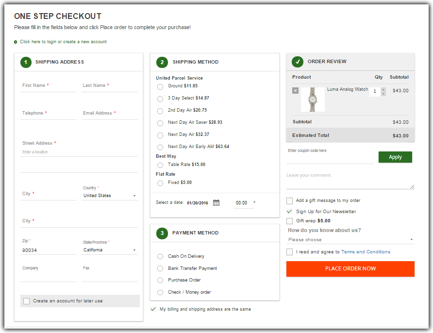

The Step-by-Step checkout page is a page with 5 separate steps including **Billing Address, Shipping Address, Shipping Method, Payment Method** and **Order Review**. Customers have to complete each step before going to the next one. On the One Step Checkout page, all steps appear simultaneously. **Customers can fill in/edit information of any steps any time.** This improvement can save Customers 2-3 minutes for checkout.

### Order Comment
Customers also can add additional comments to their orders on the Checkout page, such as special instructions or the color of wrapping paper.

### Sign up for Newsletter
You can ask Customers to sign up for your newsletter during checkout by just enabling the checkbox **Sign Up for Our Newsletter**. You can even set it checked by default. This method is an easy way to help you gain many more subscribers to maintain relationship later.

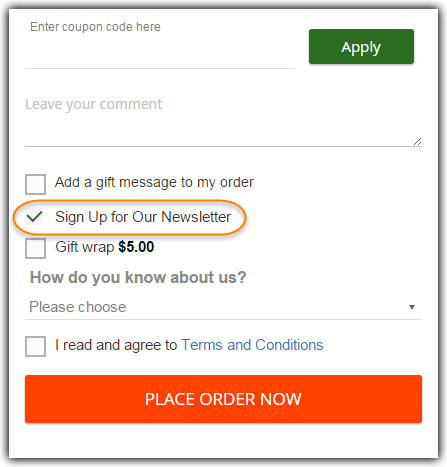

### Terms and Conditions
To avoid any arising dispute after Customers place order, make sure they fully understood and agreed to your Terms and Conditions. You’d better require Customers to check the box “I read and agree to Terms and Conditions”. When Customers click on the **Terms and Conditions** link, a popup with detailed information will show.

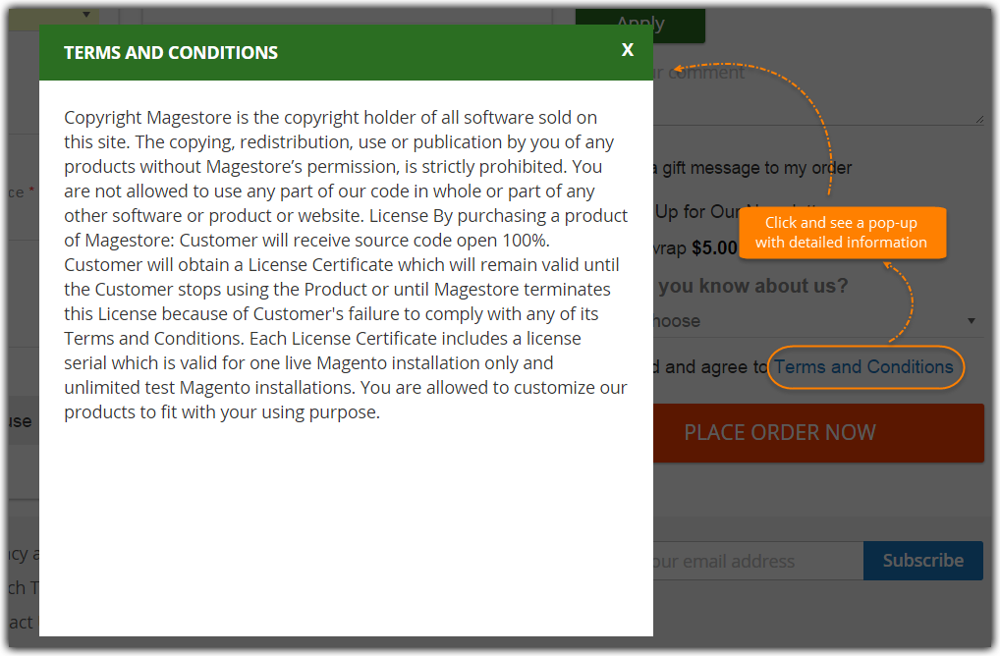

After filling in required information, Customers click on the Place order now button to finish. They will see a confirmation page like this.

### Login/Sign up if required

Store-owners may want to require Customers to log in or sign up before placing an order. If Customers already have an account, they can click on **Click here to login or create a new account**. A popup will be displayed. They just need to enter their email address and password then click on the **Login** button.

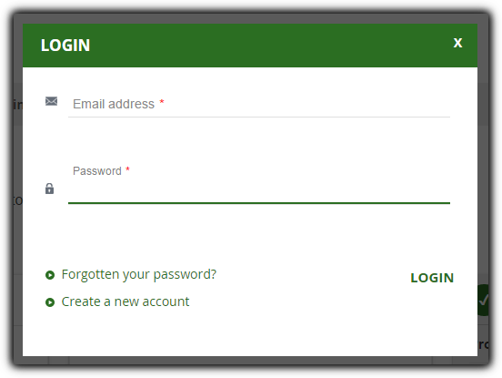

If Customers forget their password, they can click on **Forgotten your password?** Then enter their email address and click on the **Send password** button. The module will send a new password to their email address.

If Customers don’t have an account in your site, they can create one right away by clicking **Create a new account**, filling in the required information, then click **Register**. The new account will be created before placing orders.

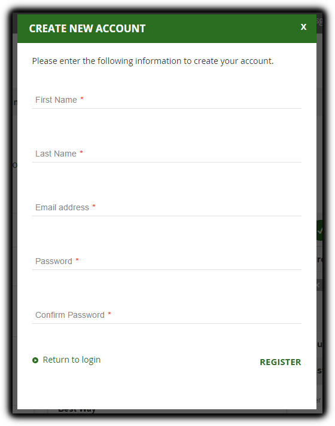

This is super convenient, right? Signup and Checkout at the same time help you manage Customers and Orders more easily without swaying conversion rate.

### Billing Address, Shipping Address
If Customers have already logged in, they can skip the **Shipping Address** section as their information is automatically added. If Customers want to change shipping address, select **New Address** and change the information.

In case of not logging in, they will see fields to fill in: First name, Last name, Address...as you configured in backend.
After providing a shipping address, if Customers want to create bill to another address, they can unselect the box **My billing and shipping address are the same** then fill information in the **Billing Address** section.

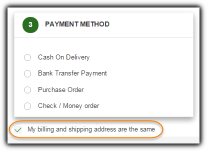

In both **Billing Address** and **Shipping Address** sections, when Customers type some first characters of their address, the system will show matching results suggested by Google.

Customers just need to select a correct option and then, other fields such as **City, Country, Zip Code, State/Province** will be automatically filled out.

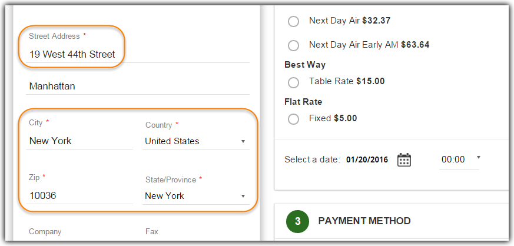

When there is any change in **Shipping Address** and **Billing Address** sections, **Shipping Method, Payment Method** and **Order Review** will be updated right away without reloading the page. Why is this feature useful? Let us give an example. A Customer may consider between 2 shipping addresses. He can see right on the checkout page that for 1 address, shipping fee is cheaper and payment method can be Cash On Delivery, but with the other address, just money transfer and advanced payment are accepted.

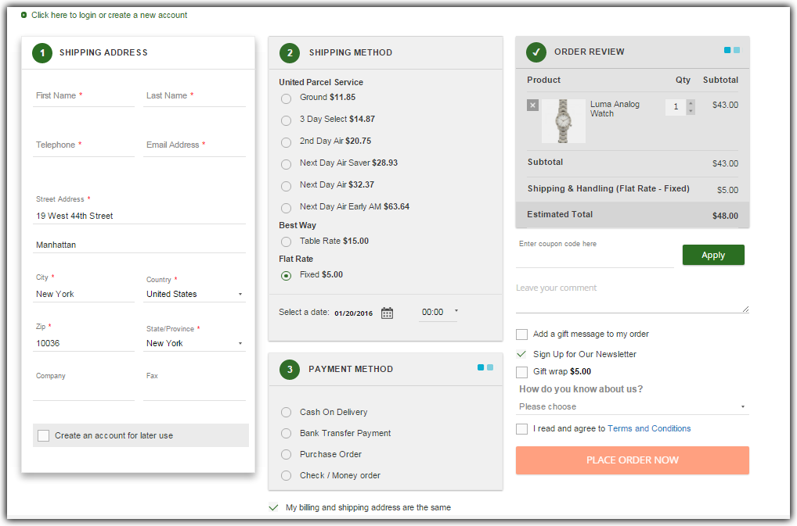

### Shipping Method, Payment Method
After Customers choose or change **Shipping Method** and **Payment Method** as preferred, the **Order Review** section will be updated correspondingly.

### Time of Delivery
To bring the most convenience to your Customers, you can enable the **Delivery time and date** in backend. Then at checkout they can select when will be most suitable for them to receive items ordered.

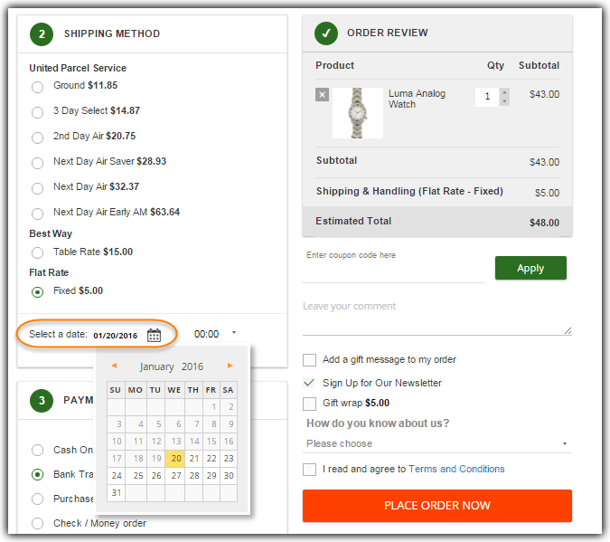

### Order Review
The **Order Review** section shows all items ordering as well as product images. If Customers change their decision, they can edit quantity or remove products without going back to the Shopping Cart page. Any changes will be updated right at checkout.

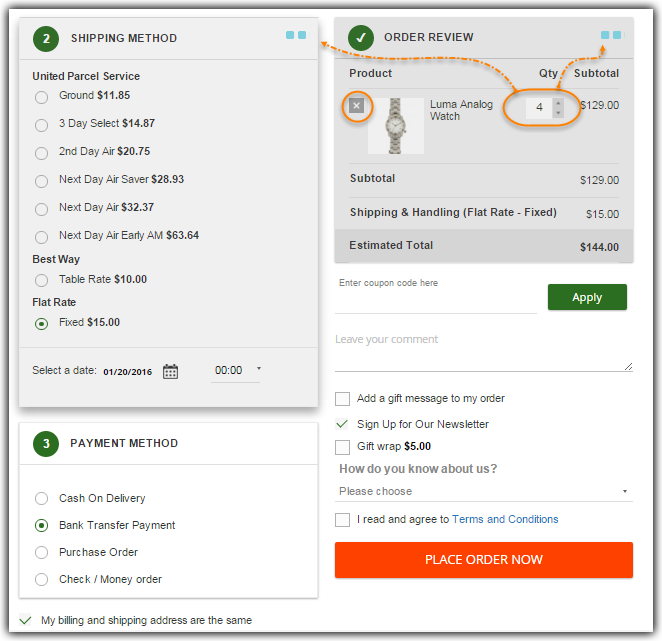

### Coupon Code

With the default checkout of Magento, Customers only can apply coupon codes on the **Shopping Cart** page. With One Step Checkout extension of Magestore, you can let Customers enter their coupon code right below **Order Review** on the checkout page.

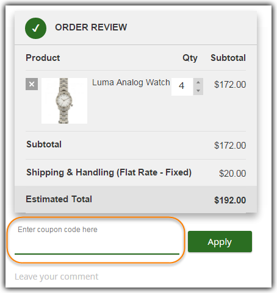

After Customers apply coupon code, the **Estimated Total** will be updated as below:

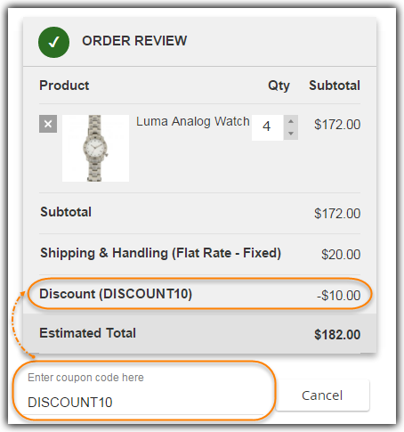

If Customers do not want to use that coupon code anymore, they can click on the **Cancel** button.

### Gift Message
Magestore’s One Step Checkout supports gift purchasing effectively. Customers can add a gift message along with their order. They just need to enter the sender name, recipient and message into text fields.

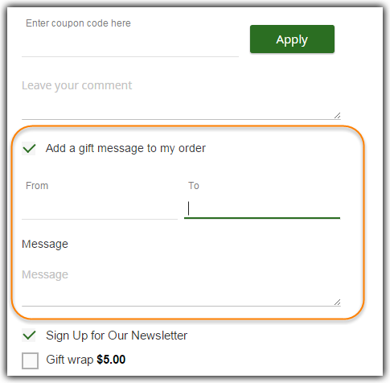

### Gift Wrap
You can provide gift-wrap service at checkout and configure its price. After Customers tick option **Gift Wrap**, a gift-wrap fee will be added, and **Estimated Total** will be updated.

## How to configure
You have viewed the features which Magestore One Step Checkout provides in frontend. This part will tell you how to enable all those features in backend.
Go to **One Step Checkout > Settings**.
You will be navigated to the **One Step Checkout Configuration** page where you can set up, configure our module to get it to work as you wish.

### General Configuration
| No        |Field            | If you choose...  | Result will be |
| ------------- |:-------------:| -----:| ---:|
| ***General***
| 1     | Enable One Step Checkout | Yes | One Step Checkout feature becomes active on the checkout page.  |
| 2     | Enable billing to different address |  Yes |Enable the checkbox named “My billing and shipping address are the same”. After Customers unselect this box, the Billing Address section will be displayed for Customers to fill in information.  |
| 3 | Enable Delivery time and date      |    Yes |Enable the Delivery time and date section on One Step Checkout page. Customers can select their preferred shipping date and time. The information is also added when Customers review their orders in My Account. |
| 4 | Redirect to checkout automatically after adding product to cart      |    Yes |Navigate Customers to the One Step Checkout page right after they add products to cart. |
| 5 | Enable suggesting address by Google      |    Yes |Show matching results suggested by Google when Customers type some first characters in the Address field. |
| ***Default Information***
| 6 | Default Payment Method      |    Check / Money order |In the **Payment Method** section, option *Check/Money Order* will be pre-selected. |
| 7 | Default Shipping Method      |    Flat rate | In the **Shipping Method** section, option *Flat rate* will be pre-selected. |
| 8 | Default Country      |    United States | In **Billing Address/Shipping Address**, *United States* will be pre-selected as Country. |
| 9 | Default Region/State      |    California | In **Billing Address/Shipping Address**, *California* will be pre-selected as State. |
| 10 | Default ZIP/Postal Code      |    90034 | In **Billing Address/Shipping Address**, the *Zip / Postal Code* field will be pre-filled in as 90034. |
|***Display Field***
| 11 | Checkout title      |    One step checkout | The text displayed at the top of the Checkout page is "***One step checkout***". |
| 12 | Checkout description      |    Please fill in the fields below and click Place order to complete your purchase! | IThe text displayed below the title to guide Customers how to process checkout is “*Please fill in the fields below and click Place order to complete your purchase!*”. |
| 13 | Hide section **Shipping Method** if only one method is applicable      |    No | Not hide the **Shipping Method** section in frontend if your store uses only 1 shipping method. |
| 14 | Enable adding comment to order  |    Yes | Show a textbox for Customers to add comments to their order. |
| 15 | Show Newsletter checkbox      |    Yes | Show a checkbox for Customers to tick if they want to sign up for your newsletter. |
| 16 | Newsletter checkbox checked by default  |  Yes | The **Newsletter** checkbox will be checked by default. |
| 17 | Show Discount Code section   |    Yes | Show a **Discount code** box for Customers to fill in their coupon. |
|***Product Thumbnail Shown In Order Review Section***
| 18 | Enable   |    Yes | The Checkout page will display product images in the **Order Review** section. |

### Style Management
This feature allows you to customize style for the Checkout page of each store view.
You can change color of headings and the **Place Order Now** button to fit your store’s theme. There are 8 colors for you to select, including orange, green, black, blue, dark blue, pink, red and violet. If none of the default colors match your desire, you can select the Custom option and then customize your preferred one using the color picker table. With each store, you can select the color you want or use the default color.
After selecting a color, you will see a preview of your checkout page with the color chosen.

Similarly, you can choose a default color for the **Place Order Now** button or customize it.

When you complete all settings, remember to click **Save Config**. Your checkout page in front-end will be displayed as your configurations:

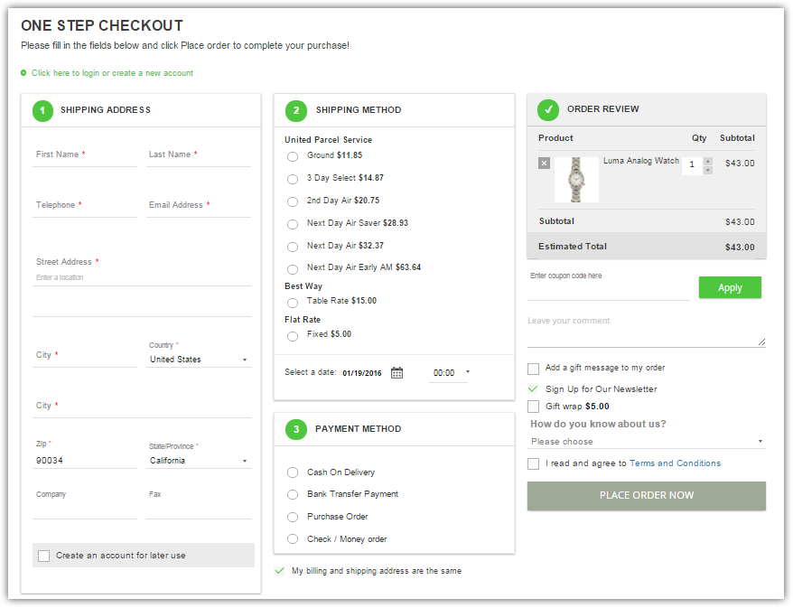

Wow, when you come to this point, you have almost grasped all the main benefits of our One Step Checkout extension. Sometimes, just viewing is not enough to really understand and enjoy something. It could be greater if you have an ownership of it and make it work as you wish. So, why don’t you take action right away to feel its amazing effects on your sales?

### Field Position Management
This section lets you enable/disable and rearrange the positions of fields in **Billing/Shipping Address** sections.
Note: ***First Name, Last Name*** and ***Email Address*** are required in Magento 2 system. If you disable these fields, Customers cannot place order even if they fill in all information.
You can rearrange fields into 2 columns like **First Name** on the left and **Last Name** on the right and spare **Address** a full column by choosing *Address* + *Null*.

Besides, this section allows you to configure multiple stores so that the position of fields displayed on the One Step Checkout page will change according to each store’s settings.
For example, if you want Default and Second store to be shown differently, choose **Main Store > Default/Second Store** in the **Current Configuration Scope** box in the top-left corner. Then, rearrange the position as you want.

After you configure in backend, the Checkout page will be shown in frontend as below:
* Default store:

* Second store:

### Required Field Management
This tab allows you to configure which fields must be filled in to complete an order. Choose **Yes** for required fields and **No** for optional fields. As in the **Field Position Management** tab, three fields, including ***First Name, Last Name*** and ***Email Address***, are required by default.

### Auto-update Sections
In this tab, you can configure which sections will be automatically updated whenever Customers change their information.
***Note:** The Checkout page is loaded fast or slowly depending on these configurations. To maximize your website’s loading speed, you should enable only triggering fields and updated sections that are necessary and disable the unneeded ones.

| No        |Field            | If you choose...  | Result will be |
| ------------- |:-------------:| -----:| ---:|
| ***Sections updated when changing in Address***
| 1     | Auto update Sections following changes in Address | Yes | Auto-update sections **Shipping Method, Payment Method** and/ or **Order Review** when Customers change information in **Billing/Shipping Address**.  |
| 2     | Address fields triggered updating Sections |  Country, Postcode, State/region, City |Auto-update chosen sections when Customers change information in the *Country, Postcode, State/region, City* fields.  |
| 3 | Reload Sections   |  When all required fields are field | Reload chosen sections when Customers change information in all required fields above. |
| 4     | Update Shipping Method | Yes | Auto-update the **Shipping Method** section when Customers change information in triggering fields.  |
| 5     | Update Payment Method |  Yes | Auto-update the **Payment Method** section when Customers change information in triggering fields.  |
| 6 | Update Order Review   |  Yes | Auto-update the **Order Review** section when Customers change information in triggering fields. |
|***Sections updated when changing in Shipping Method***
| 7     | Update Payment Method | Yes | Auto-update the **Payment Method** section when Customers change information in **Shipping Method**.  |
| 8     | Update Order Review |  Yes |Auto-update the **Order Review** section when Customers change information in **Shipping Method**.  |
| ***Sections update when changing in Payment Method***
| 9     | Update Order Review | Yes | Auto-update the **Order Review** section when Customers change information in **Payment Method**.  |

### Terms and Conditions

* **Show Terms and Conditions**: Choose whether to show the **Terms and Conditions** popup on the One Step Checkout page or not.
* **Terms and Conditions Title**: Set a title for the **Terms and Conditions** popup.
* **Terms and Conditions Content (HTML)**: Enter your **Terms and Conditions** by using HTML code.
* **Enable custom size**: Choose whether to customize size of the **Terms and Conditions** popup or not.
* **Width**: Set the width of the popup
* **Height**: Set the height of the popup

### Admin Order Notification
An important feature of One Step Checkout is to send email notifications to Admin when new orders are placed. Moreover, you can enter a list of emails which you want to receive email notification.
To customize email template, go to **Maketing Email Templates**, select **Add New Template**, then choose the **New Order Notification** template and click on the **Load Template** button.

After the template is loaded, you can change its content in the **Template Information** section. The following is an example of email notification:

### Gift Wrap Configuration

If you enable Gift Wrap, there will be a checkbox for Customers to tick if they want to wrap the products in cart.
You can choose the gift wrap type to be *per item* or *per order*. Also, you can set the gift wrap fee for each item or order here. Once Customers choose your gift wrap service, the total gift wrap fee will be added to the Grand Total.

### Gift Message Configuration

If enabled, there will be a form for Customers to add sender, recipient name and a gift message for their friend.

### Checkout Mode

| No |Field         | If you choose...  | Result will be |
| --|:-------------:| -----------------:| --------------:|
| 1 | Show Login Link | Yes | The Login link is shown on the checkout page.  |
| 2 | Enable Registration | Yes |Customers who don’t have an account can create account before placing order.|
| 3 | Allow Guest Checkout   |  No | Customers cannot check out as guest. They need to register an account to place order. |
| 4 | Login Message | - | The text displayed as the Login link is “*Click here to log in or create a new account*”.  |

* Login Link in frontend:

* Registration in frontend:

