# REWARD POINTS FOR MAGENTO 2

**Version 1.0.3**

*Confidential Information Notice*  

*Copyright 2017. All Rights Reserved. Any unauthorized reproduction of this document is prohibited. This document and the information it contains constitute a trade secret of Magestore and may not be reproduced or disclosed to non-authorized users without the prior written permission from Magestore. Permitted reproductions, in whole or in part, shall bear this notice.*

## INTRODUCTION

There is no doubt about the benefits of Customer loyalty to your business. The question is how to keep Customers returning and buying in your store? We offer you a wonderful solution- that is Magento Reward Points Plus module. It is designed to maximize Customers engagement in your store by many useful features.

With Reward Points –Standard Edition, your Customers can receive reward points when placing orders on your site. These points then can be converted to money for checkout at the rate configured by you. The System will show messages about the number of points Customers will earn and spend. Customers certainly feel more encouraged to purchase at your site when they can get some bonus for doing that!

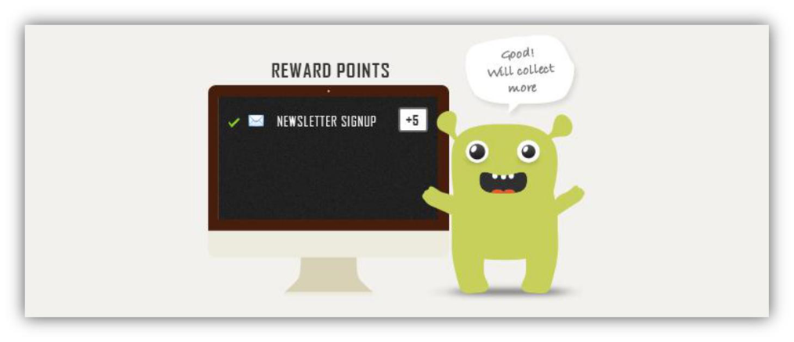

## How to use

### How to earn points

When placing an order, Customers can earn points based on the rate set by admin.

Our Standard edition makes sure that Customers are well aware of your reward point policy by showing messages on many pages. For example, on Product Detail pages, there will be a notification for Customers that says “You could receive some Points for purchasing this product”.

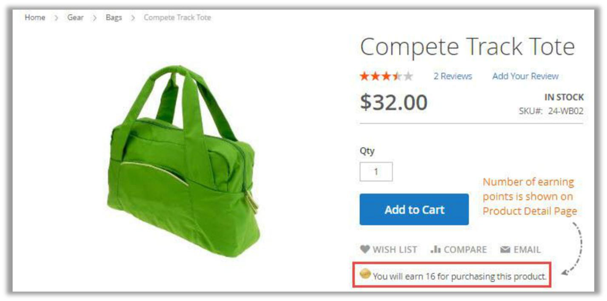

Also, after clicking on the **Add to Cart** button, on **Mini Cart**, Customers will see another notification “**Check out now to earn points**”.

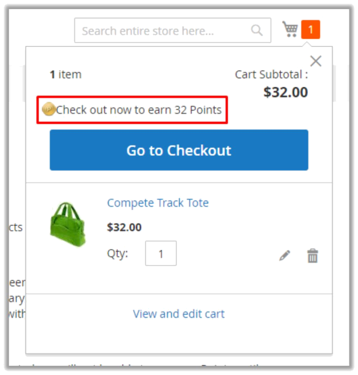

If Customers have not logged in yet, a notification message “**Login and checkout to earn points**” will be shown on mini cart:

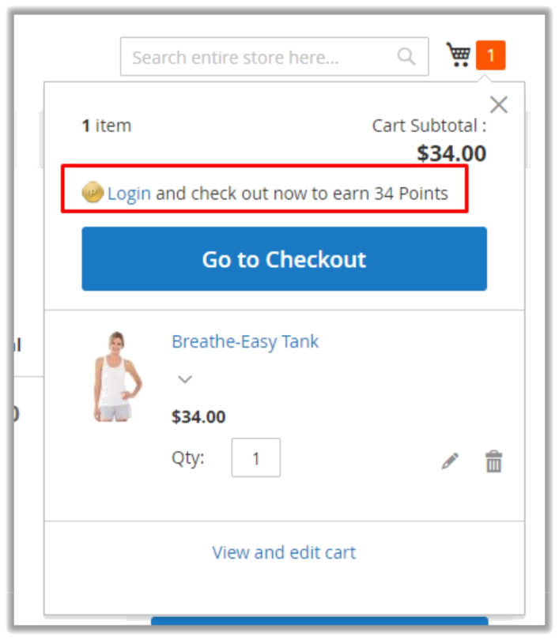

On **Checkout** page, Customers can see exactly the number of points they earned from buying that product in the **Grand Total** box:

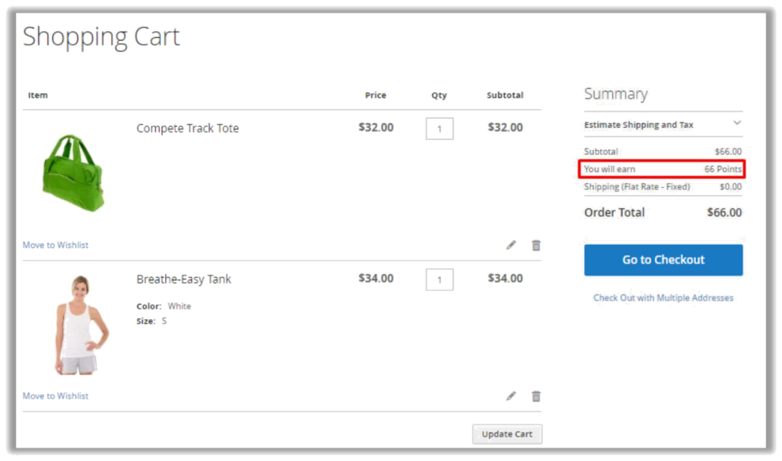

If Customers have not logged in yet, a notification message “**Login and checkout to earn points**” will be shown on **Grand Total** box of checkout page:

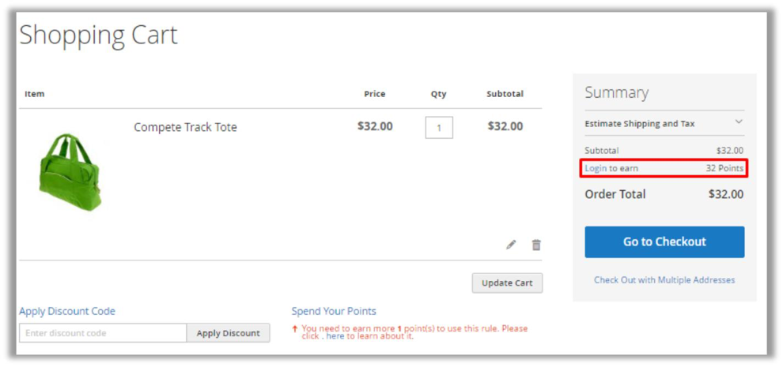

After placing an order successfully, Customers can check their point balance right next to the **My Account** top link or can go directly to that link:

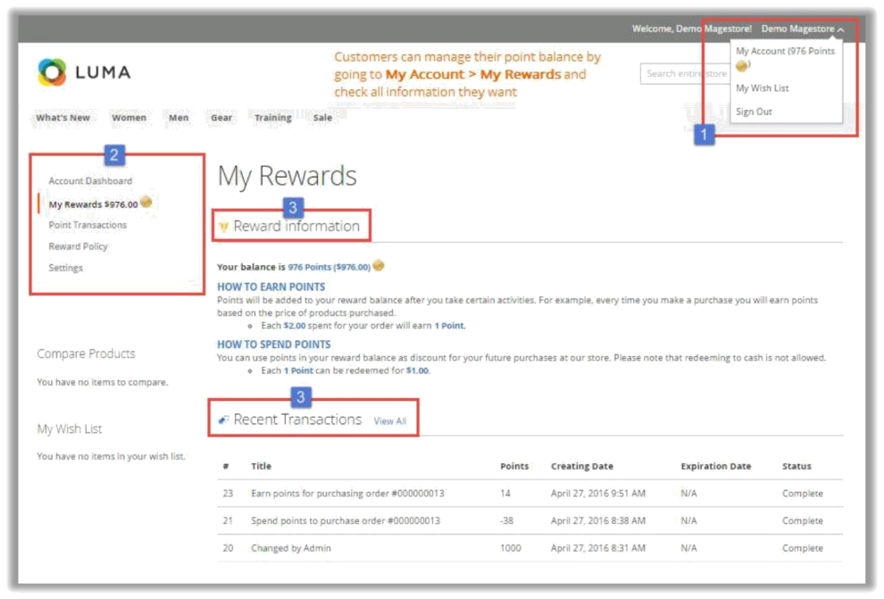

### How to spend points

On **Shopping Cart** and **Checkout** pages, Customers can move the slide forwards or backwards to select the number of points they would like to spend. They can also just click on the **Minus** or **Plus** icons. Besides, they can enter this number in the empty box or tick the checkbox “**Maximize my discount with points**” to spend the maximum number of points.

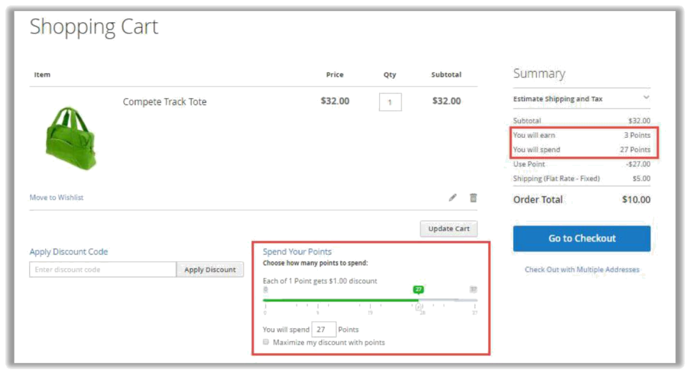

On the **Checkout** page, System shows a similar form for Customers to edit the number of points they want to spend for their orders:

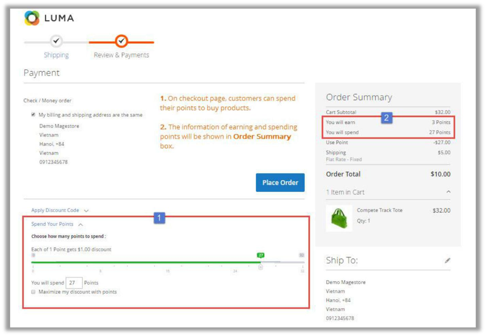

### Manage reward points

Customers can follow and manage their current points in 2 places:

On the one hand, they can view their current points on the top link as below:

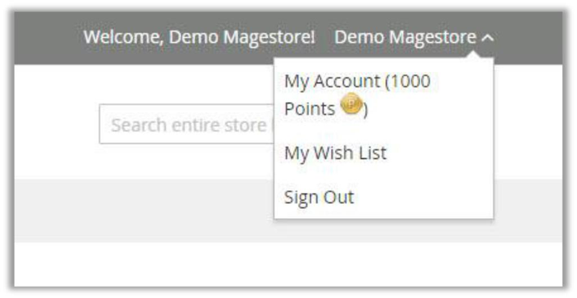

On the other hand, they can go to **My Account > My Rewards** to view more information.

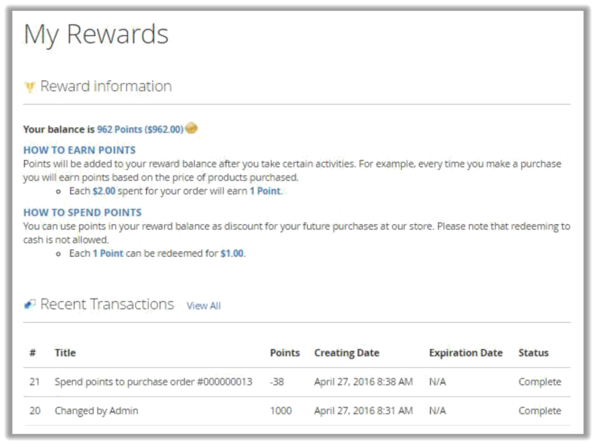

As you can see, this page can be divided into two parts: **Reward Information** and **Recent Transactions**

**Reward Information:** In this part, Customers can view their current balances as well as description about earning/ spending point rates on your site.

**Recent Transactions:** This part provides Customers with information on their transactions of reward points including ID, points, action, date and status.

If Customers want to see all transactions, they can click on the **View all** links or the **Point Transactions** tab.

Besides, in the **Settings** tab of the **Reward Points** navigation, Customers can set up their **Reward Points Subscriptions**.

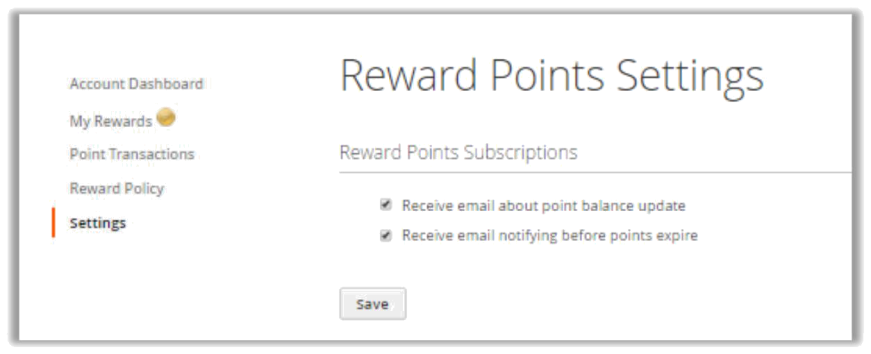

## HOW TO CONFIGURE

### Manage earning rates

Go to **Backend > Reward Points > Earning Rates**. Then the **Earning Rates** page will be shown, allowing you to do many tasks:

 - **Add a new rate**

In order to add a new earning rate, you can click on the **Add Rate** button and then fill out all the required data such as **Money spent for order, Earning Points, Status, Websites, Customer groups, Priority**.

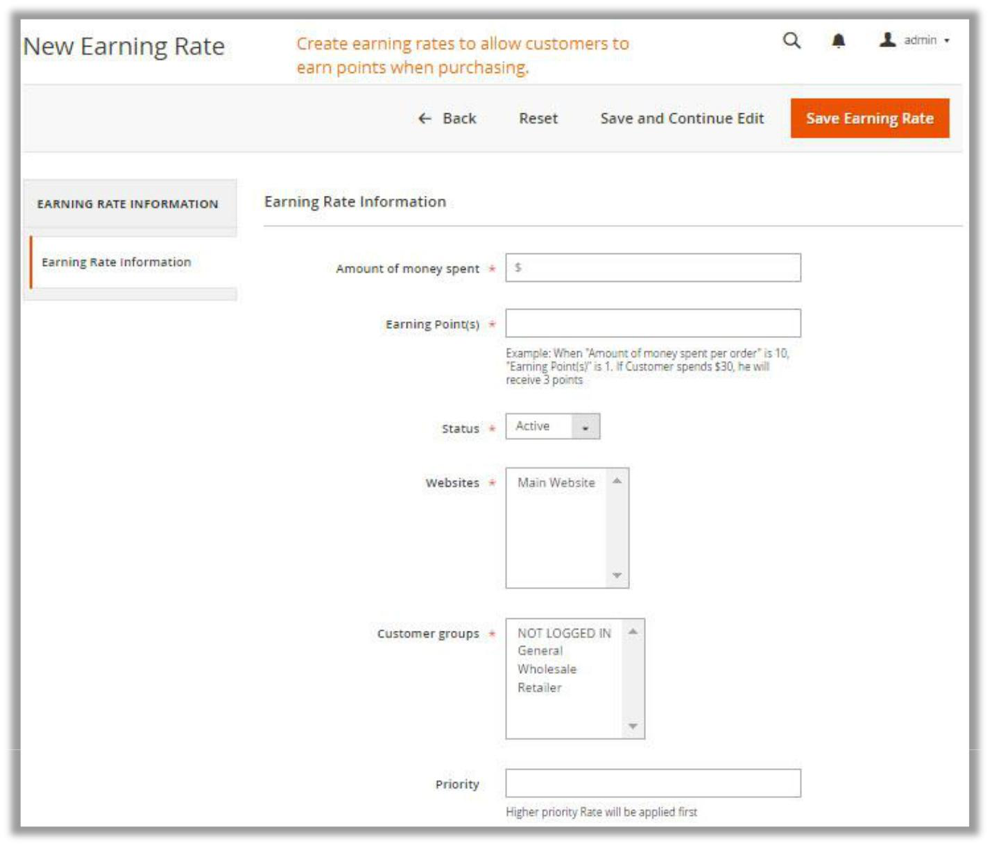

Please note that with **priority**, the rate with the highest level of priority will be applied first. In case there are two rates with the same priority, the rate created sooner will be applied.

After you finish filling out all the required data, remember to click on the **Save** or **Save and Continue Edit** button to save your work. If you click on the **Save** button, you’ll be navigated to the **Earning rates** page and your rate will be shown as below:

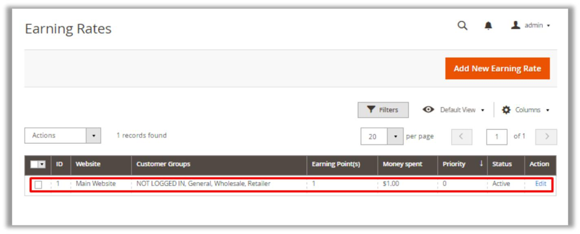

 - **Edit/ Delete an existing rate**

In case you want to edit a rate, please click on the **Edit** link in the **Action** column.

Then you will be redirected to the **Edit Earning Rate** page:

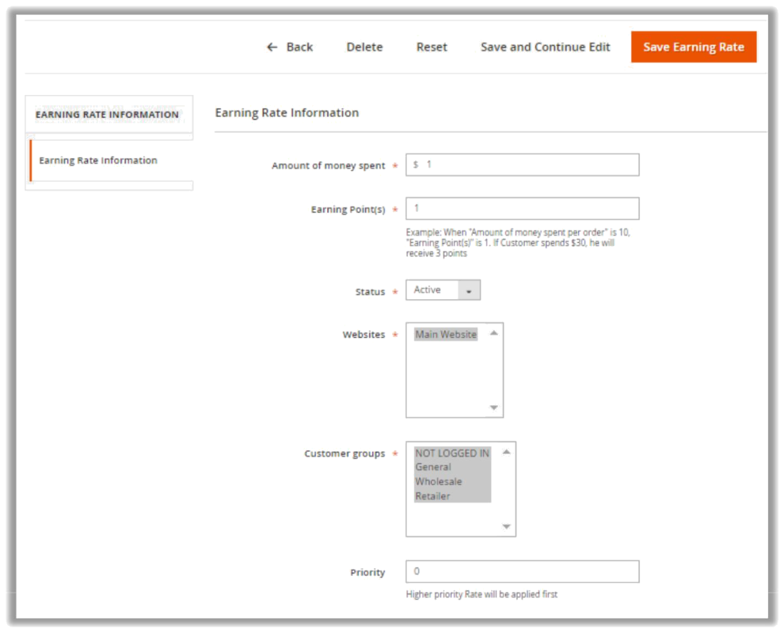

After editing the rate as you want, remember to click on the **Save** or the **Save and Continue Edit** button to save your work.

To delete a rate, you can go to the **Edit Rate** page and then click on the **Delete** button on top of the page.

### Manage spending rates

Go to **Backend > Reward Points > Spending rates**. Then the **Spending Rates** page will be shown, allowing you to do many tasks:

 - **Add a new rate**

In order to add a new spending rate, you can click on the **Add Rate** button and then fill out all the required data such as **Points spent, Discount received, Status, Limit spending points based on, Websites, Customer groups and Priority**.

For example, if you want to allow your Customers to exchange 2 points for $1 to spend on their orders, you can enter data as in the image below:

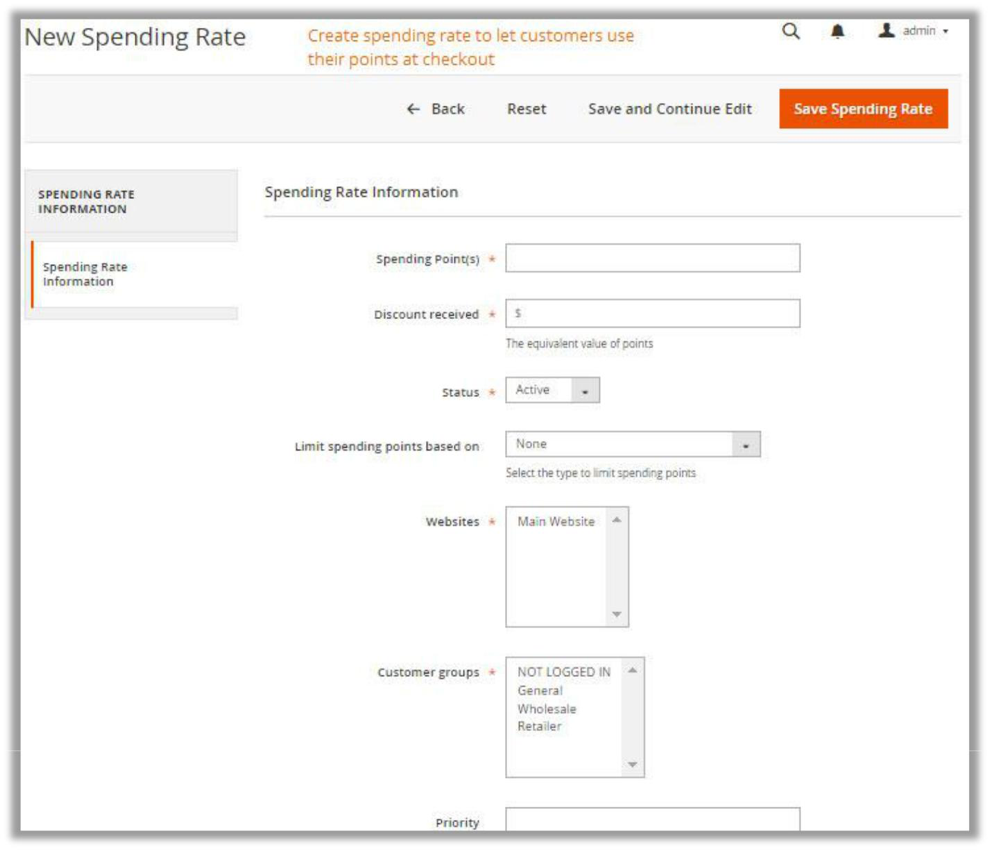

Besides, you can also configure priority for rates. The rate with the highest priority will be applied first. In case there are two rates with the same priority, the one created sooner will be applied.

After you finish filling out all the required data, remember to click on the **Save** or the **Save and Continue Edit** button to save your work. If you click on the Save button, you’ll be navigated to the **Spending Rates** manager page and your rate will be shown as below:

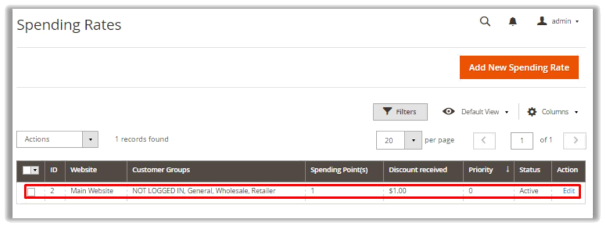

 - **Edit/ Delete an existing rate**

In case you want to edit a rate, please click on **Edit** link in the **Action** column.

Then you will be redirected to the **Edit Spending Rate** page:

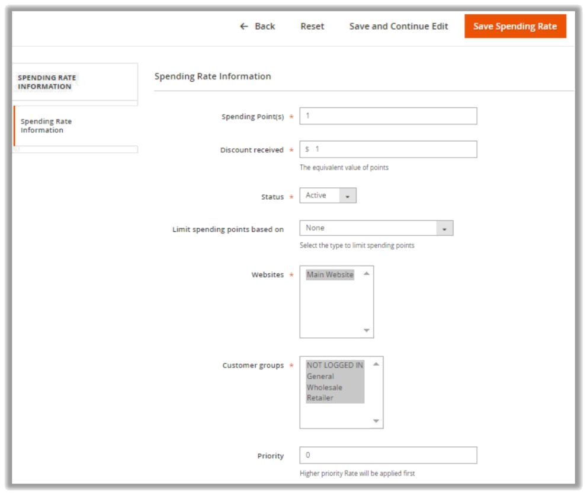

After finish editing, remember to click on the **Save** or the **Save and Continue Edit** button to save your work.

To delete a rate, you can go to the **Edit Rate** page and then click on the **Delete** button on top of that page.

### Manage transactions

Go to **Backend > Reward Points > Transactions**

Then all the transactions related to reward points will be shown as below:

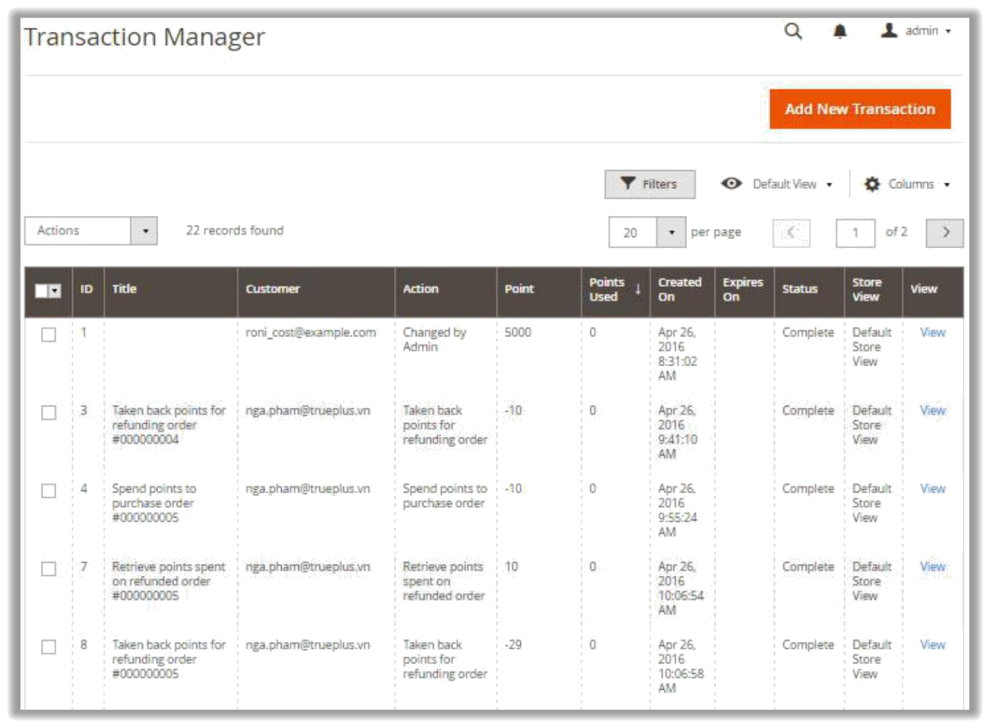

On this **Transaction Manager** page, you can view a list of all point transactions together with many general information including **Customer, Transaction Type, Points Used, etc**.

Moreover, you can filter and search for the information you want as well as export this table to CSV/XML/Excel files.

You can **Complete, Cancel** or make transactions **expire** by choosing the status in the **Action** dropdown list and checking checkboxes of those transactions you like before clicking on the **Submit** button.

To view details of each transaction, you can click on the corresponding row:

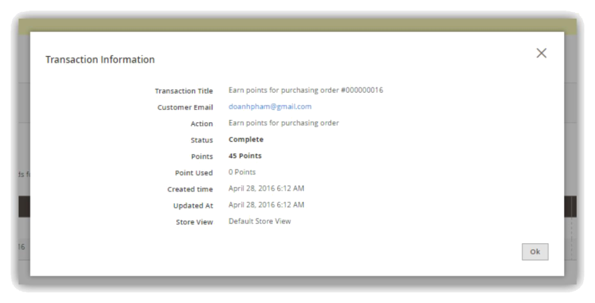

In order to add a new transaction, you can click on the **Add Transaction** button, fill out all the required data and then click on the **Save Transaction** button.

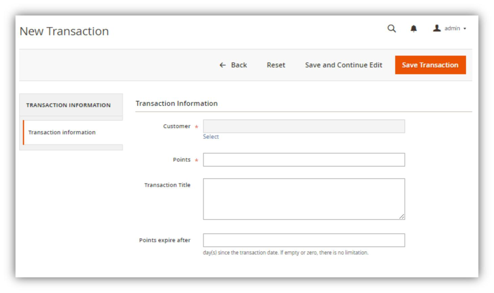

### Manage Point Balances of Customers

####  Manage Point Balances

Go to **Customers > Manage Customers**. On the **Customer Manager** page, you can choose the Customer you want to change balance by clicking on the **Edit** link in the **Action** column.

After clicking on the **Reward Points** tab, all of that Customer’s information will appear as below:

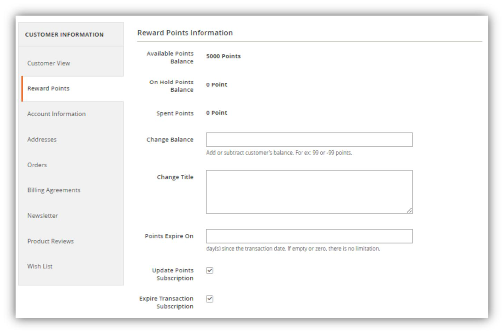

**Reward Points Information:** In this session, you can change the Customer’s balance by filling an integer in the **Change Balance** field. For example, if you enter 5, then 5 points will be added to that customer’s balance and vice versa, “-5” means that Customer’s balance will be deducted 5 points.

Also, you can configure other information like **Update Points Subscription** or

**Expire Transaction Subscription**

**Transaction history:** This part lists all of that Customer’s transactions:

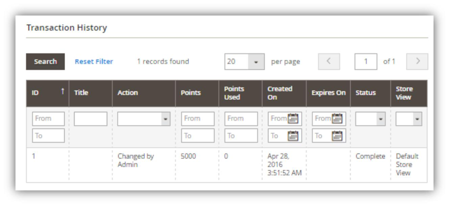

#### Change Point Balances

There are two ways to change point balances of customers.

You can change point balances for each customer by entering the **Change Balance** in the **Reward Point** session of **Customer information** page. After you save, the **Available Points Balance** will be updated.

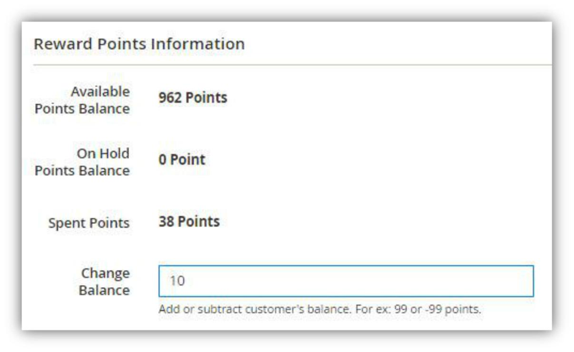

Another way is that you can change point for many customers at the same time by importing points from csv file. Go to **Reward Points** > **Manage Point Balances**. On this page, the list of customers will be shown with Point Balance column.

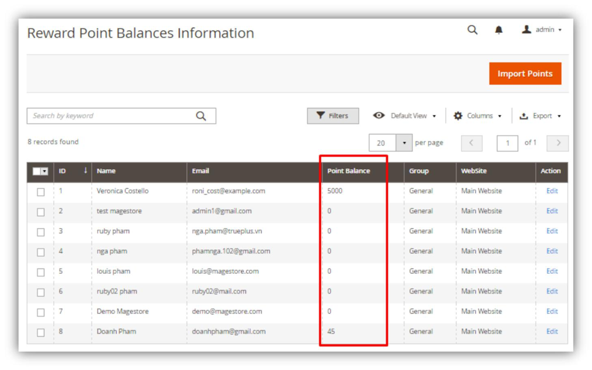

Next step, you need to click on **Import Points** button, the Import Points page will be shown so that you can import file from your computer. Please download the sample file, edit customers’ information then import it. After being imported successfully, the Point Balance of customers will be updated.

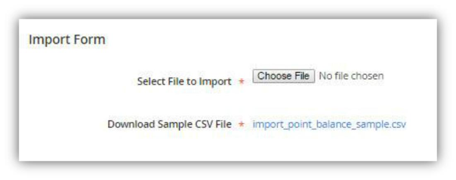

Besides, you can also export csv file from the list of customers in **Reward Point Balances Information** page. You can also use this file to import again.

### Create and refund orders

Go to Sales > Orders. Then the System will display all Customers’ orders. Now, let’s see how Reward Points - Standard edition is used in creating and refunding orders.
 
 - **Create Orders**

First, please click on the Create new Order button to see the Order form.

After selecting a Customer, a store and adding Products, you will see the **Use Customer Reward Points** box in which you can set up the number of points the Customer will spend for his order.

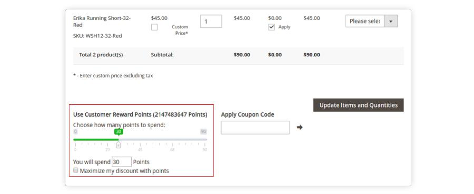

The **Order Totals** box will also display the number of points that Customer will spend:

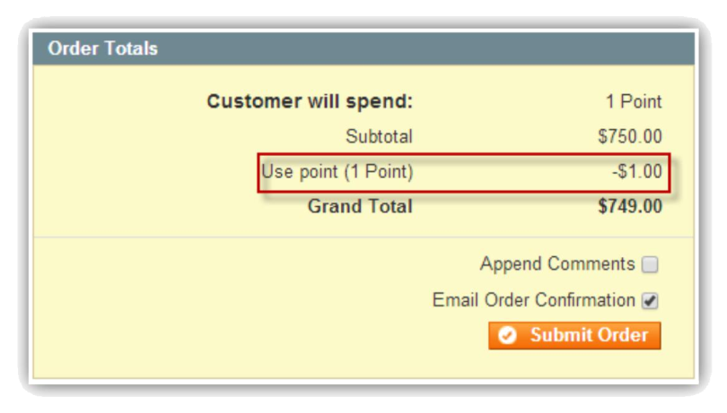

After filling out all the required fields, please click on the **Submit Order** button to finish creating the new order. Then the **Order totals** box shows the total spent point

- **Refund orders**

When Customers refund orders, you can decide how many points to refund them as well as how many points to get back from them. By default, the System will set those values as the number of points that Customer spent and the number of points that Customer earned respectively.

First, please choose the order your Customer wants to refund by clicking on the **View** link in the **Action** column.

Now, please click on the **Credit Memo** link to process the order refund. In the **Refund Total** box, you can choose to refund a number of points you like among those that the Customer spent and get back a number of points among those that he earned. After that, please click on the **Refund Offline** button to finish your refunding.

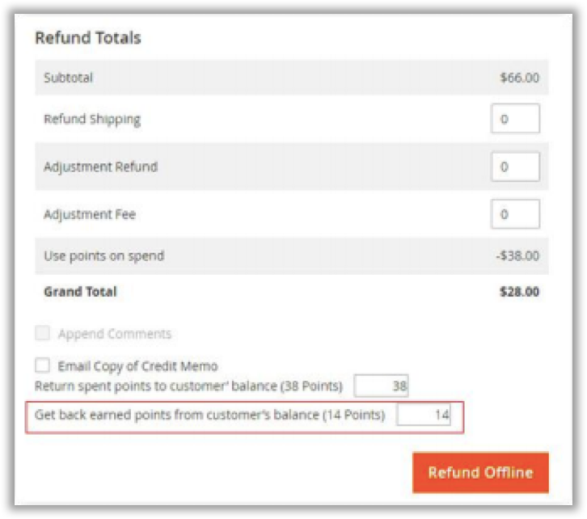

### Settings

Go to **Backend > Reward Points > Settings**. Then you will see 5 tabs to configure:

**General Configuration, Earning Configuration, Spending Configuration, and Display Reward Points Configuration**.

**General Configuration** tab:

**Enable Reward points: ** Choose “Yes” if you want to enable Reward Points – Standard edition.

**Label for Point: ** You can give “point” another name to fit with your store such as Gold, Star, etc. If empty, the default label “Point” will be used.

**Label for Points (plural):** You can give “points” another name to fit with your store such as Gold, Stars, etc. If empty, the default label “Points” will be used.

**Reward Points image:** You can upload an image file you like to represent Points. If empty, the image on the template will be used.

**Use Reward Policy page:** Choose “yes” if you allow showing the Reward Policy link on the left navigation.

**Reward Policy page uses CMS:** This is the CMS page displayed when Customers click on the Reward Policy link.

**Use Reward Welcome page:** Choose “yes” if you allow showing the Reward Point link on the footer.

**Reward Welcome page uses CMS:** This is the CMS page displayed when Customers click on the Reward Point link.

 - **Earning Points Configuration**

No| Field| If you choose| Result will be|
---|---|---|----
1| Rounding Method|Rounding down|Earned  points  will  be  rounded down. For example, 10.2 points generated from an order will be rounded down to 10 points|
2| Points expire after| 10| Points can only be used within 10 days after being earned|
3| Number   of   points   in| 1000| A  Customer  can  have  1,000 balance allowed points   in   his   balance   at maximum.
4| Earn points from tax| Yes| You   allow   Customers   earn points from tax.
5| Earn points from| Yes| You allow Customers earn Shipping fee points from shipping fee.
6| Allow earning point| Yes| You allow Customer  receive when using points  to points  from  order  whes  using spend points to spend.
7| Allow receiving points| Yes| Points are recorded in when invoice is created Customer’s  balance  when  his invoice is created.
8| Hold point transactions| 2| Transactions from which for Customers  can  earn  points  are held for 2 days before points are actually rewarded to Customers.
 

 - **Spending Points Configuration**

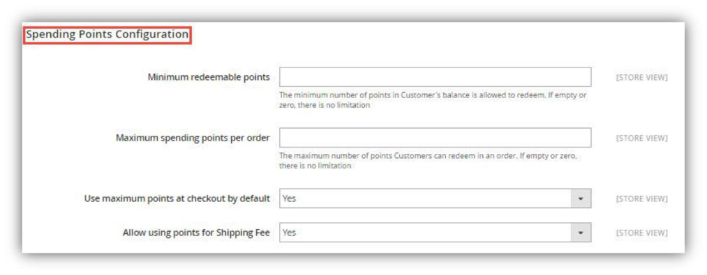

No.| Field| If you choose…| Result will be…|
---|---|---|---
1| Minimum redeemable| 100| Customers  have  to  redeem  at points least 100 points.
2| Maximum spending points| 200| Customers can spend 200 per order points  at  maximum  on  an order.
3| Use  maximum  points at checkout by default| Yes| On cart page or checkout page,  the  “Maximize my  discount with  points”  checkbox  will  be checked by default
4| Allow  using points for Shipping Fee| Yes| You  allow  using  points  for Shipping Fee

 - **Display and Email Configuration**

No.| Field| If you choose…| Result will be…
---|---|---|---
1| Show total point balance next to My Account link| Yes | The point balance will be shown next to My Account link
2| On Product Page| Yes| The points collected will be shown on Product page| 
3| On Minicart| Yes| The points collected will be shown on Minicart
 

 - **Display and Email Configuration**

No.| Field| If you choose…| Result will be…
---|---|---|---
1| Enable email notification| Yes| System will send notification emails automatically to Customers.
2| Sender| Sales representative| This will be the name of the sender in notification emails.
3| Template   of   email   sent   to Customer  when  point  balance  is updated| |Choose the template emails that  you  want  to  send  to Customer when balance is updated
4| Template   of   email   sent   to Customer  before  a transaction expires| | Choose the template emails that  you  want  to  send  to Customer before transaction expires
5| Send  reminder  email before  a transaction expires| 7| Notification email will be automatically sent to remind Customers 7 days before the transaction expires.|

Remember to click on **Save** or **Save and Continue Edit** button to save your configuration.
