# PURCHASING MANAGER - USER GUIDE FOR MAGENTO 1

## Introduction

In this user guide, we provide you a very detailed instruction in how a Purchase Manager controls all tasks involved in purchase management. Managing suppliers, pricelist, quotation and purchase order is easier than ever for a purchase manager with our step-by-step user guide by role.

Power up yourself with our [Purchasing Manager solution](https://www.magestore.com/purchasing-manager) to ensure cost-saving purchases in a timely manner.

## Permission Matrix
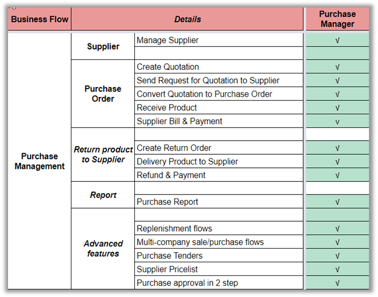
## User Guide for Purchasing Manager
### Manage Supplier and Pricelist
#### Manage Supplier 
To create a new supplier, go to **Supplier > Manage Suppliers**. Then you will navigate to **Manage Supplier** section shown as follows:

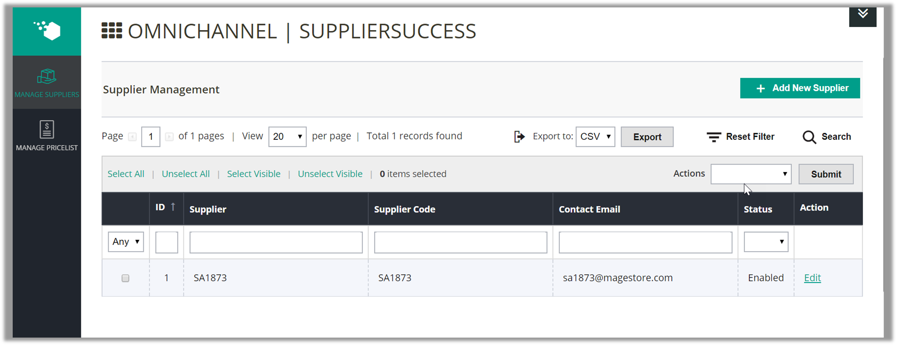

This is a page where you can view all your suppliers list with a lot of information including **Supplier name, Supplier code, Contact email, Status**. Besides, you can edit, change status or delete suppliers one by one or in bulk. In this page, you also can export the supplier list to CSV/XML files by clicking on the **Export** button shown as the below image:

#### Add New Supplier
To add a new supplier, click to the **Add New Supplier** button on the top-right corner of the **Manage Suppliers** page. Then you need to fill in information in these following tabs:
- **Supplier Information**: In this tab, you need to fill in all required field including supplier name, supplier code, contact person, email. You should add description for each supplier to differentiate between this supplier and the rest. Do not forget to enable the supplier.

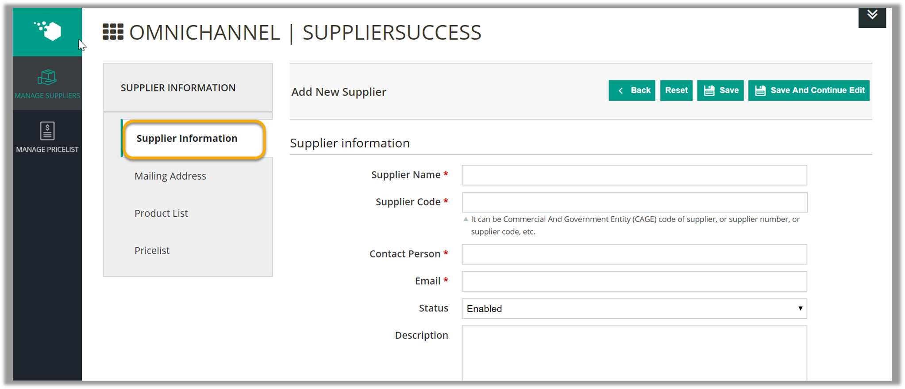

- **Mailing Address**: All information in this tab are optional for your supplier, so you don’t need to fill all of them.

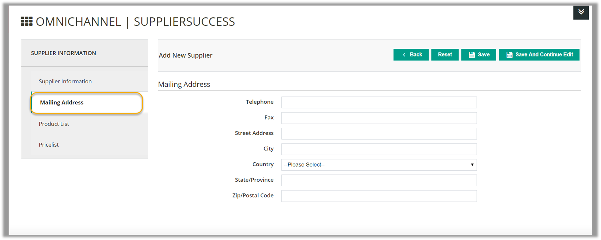

- **Product List**: This tab allows you to add and manage products of the supplier you are creating. You can assign products to your supplier by importing a CSV file.

Please click on the Import products >>> Choose File button, select a CSV file, then click on the Import button.

If you are not clear about the format of the CSV file, you can download our sample file. After products imported, the list of products will be updated with **ID, Name, SKU, Supplier product SKU, Cost, Tax from the CSV file**.

- **Pricelist**: This is a page where view all pricelist of the supplier. In this page, you also can export the pricelist to CSV/XML files by clicking on the Export button

Remember to click on the Save or Save and Continue Edit button to save your work

#### Manage Pricelist
“Pricelist is a list of prices for the goods offered by a supplier. It usually consists of Minimal Qty and Cost”

Please go to **Supplier >>> Manage Pricelist** to view the pricelist with information such as **Product SKU, Product name, Supplier, Minimal Qty, Purchase Price, Start date, End date**

In order to add pricelist into the system, you click to Import Pricelist button, choose a CSV file from your computer, then click to **Import** button. If you are not clear about the format of the CSV file, you can download our sample file.

Right to the page, you can remove the pricelist one by one or mass remove

In order to update the pricelist, you select the pricelist you want to update, change information of the pricelist, then click to Mass Update button.

You also can export the pricelist to CSV/XML files by clicking on the Export button.

### Manage Quotations
#### Create a New Quotation

“A quotation (or a request for quotation) is the proposal of price and quantity of goods that store owners send to suppliers. The quotation will become purchase order when a seller sends confirmation of price and availability of products stated in the quotation.”

To create a new quotation, please go to **Purchase Management > Quotation > Create Quotation**.
##### Input General Information
Fill in all required information including **Created Time, Supplier, Currency, Currency Exchange Rate** and **Comment** (optional); then click **Prepare Product List** to go to the next step.

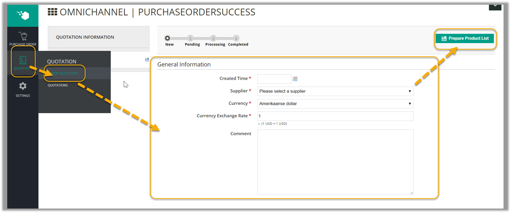
##### Prepare Product List
In this step, there are 6 ways for you to prepare product list as shown below:

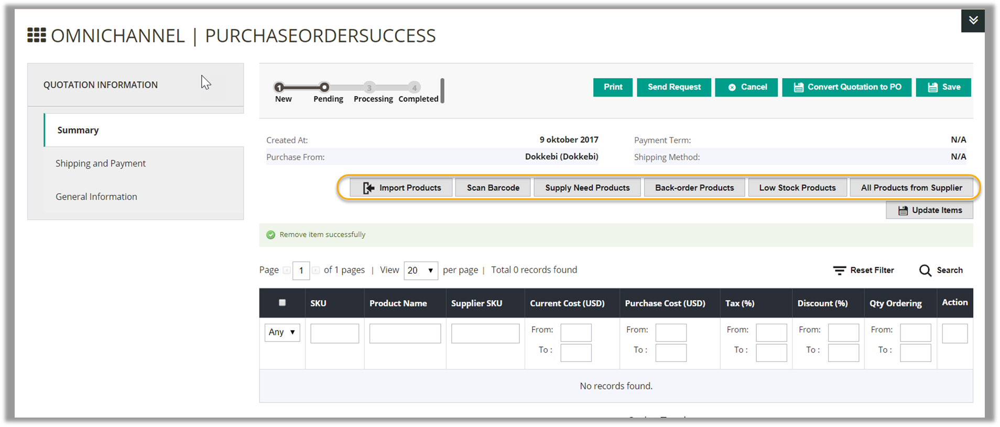

1. **Import Products** via a CSV file (a sample file is provided)
Scan Barcode to prepare product (if Barcode Management module is also installed);

2.  Prepare product list based on **Supply Need Products** forecast. The system will calculate the number of stock that may be in need in an upcoming period based on its sales. There are 4 steps you need to follow:
- Step 1: Select the criteria for the system to forecast Supply Need Products: 
    - Warehouse: choose the warehouse containing the stock to be forecasted; 
    - Sales Period: the system will examine the stock’s sales statistics in this period to make forecast. 

Options in the drop-down list include last 7 days, last 30 days, last 3 months and custom range (if you want another specific period); o Forecast Supply Need To: the system will predict if the stock on hand is enough for sales until this date.
- Step 2: Click **Show Supply Needs** and the Supply Need results will appear in the table. The table shows the current quantity in stock, its sales quantity per day, date when your stock on hand is still enough for sales and the supply need quantity.

- Step 3: Select the products in the table that you want to add to the Quotation.

- Step 4: Click Add Selected Products and the products will be added to the Quotation.

3. **Prepare Back Order Products**. Back order products are those that have been ordered by customers but currently not available in stock;

4. **Prepare Low Stock Products**. If Inventory Management module is installed, Low Stock products are suggested according to your low stock rules. Select a low stock notification from the drop-down list, then select the products you want to create quotation and click **Add Selected Products**.

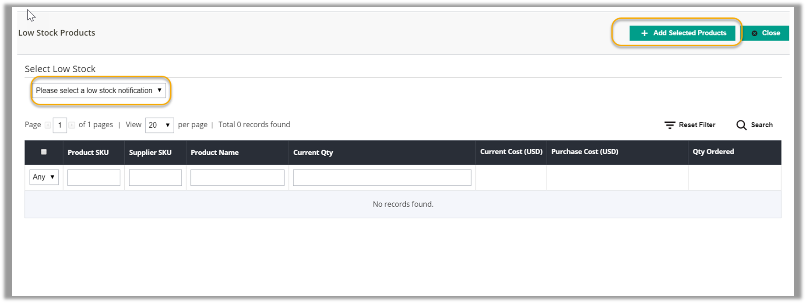

5. Select products from the list of products from that specific supplier with the **All Products** from Supplier button.
You can manually enter the **Purchase Cost, Tax, Discount and Ordered Qty** for each product in the grid. Current cost is the unit price you already knew, which can be blank. Purchase cost is the unit price at the time of creating the PO. Remember to click **Update Items** to save your edits.

After enter all required fields, click **Save** button and Order Totals is automatically calculated.

#####  Edit Shipping and Payment method
You can set up **Shipping and Payment method** for the quotation:

- Enter the address you want the stock to be shipped to
- Select a shipping method for the quotation
- Estimate and enter the shipping cost
- Set dates when you start the shipment and expect delivery
- Select the payment term
- Choose the method to send order: N/A, Email, Phone, Fax, Vendor website

After filling out the form, do not forget to save all the changes. Now you can **Send Request** to the suppliers, **Save** or **Print** the quotation. If you want to **Convert Quotation to P.O**, read more in the **_Generate Purchase Order from Quotation_** section.
#### Manage Quotations
To manage all created quotation, please go to **Purchase Order Management>Quotations**:

Each quotation is listed with related information: **Reference Number, Created Date, Supplier, Requested Qty, Grand Total** (Inclusive Tax), **Status and Action** (to view more details). Please note that the quotations which are converted into PO will be removed from this list.

### Manage Purchase Order
“Purchase Order (PO) is a document sent to a specific supplier to purchase more inventories for your warehouses. It contains descriptions, quantities, prices, discounts, payment terms, date of performance or shipment, other associated terms and conditions.”
#### Create a New Purchase Order

To create a new purchase order manually,go to **Purchase Management > Purchase Order > Create Purchase Order**.

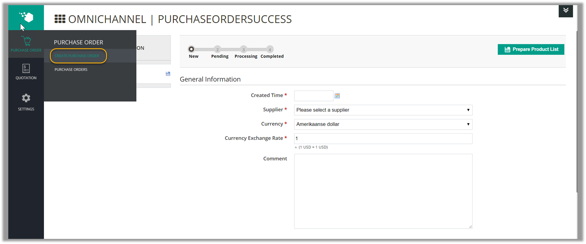

##### General Information
Fill in all required information including **Created Time, Supplier, Currency, Currency Exchange Rate**. You can also add extra information in the **Comment box** notification. Supplier can also view this comment if you send them a email later. Then click **Prepare Product List** to continue.

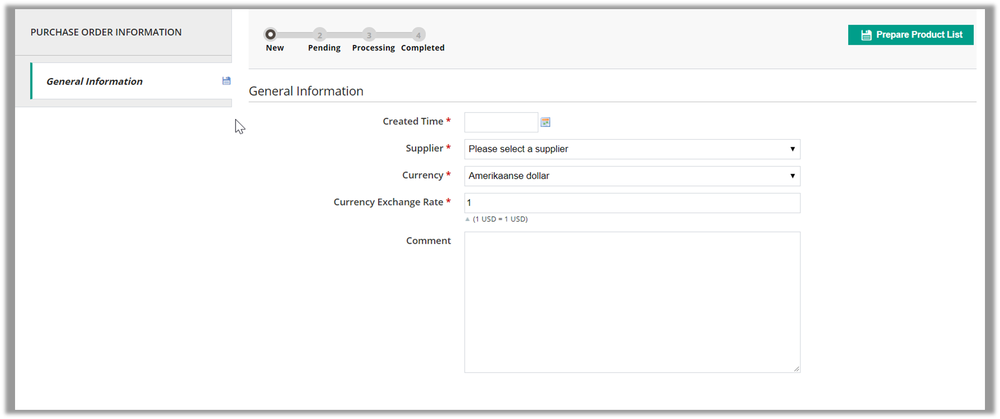 

##### Prepare Product List
In this step, there are 6 ways for you to prepare product list. (These 6 ways are the same as how to prepare products list to create a quotation)

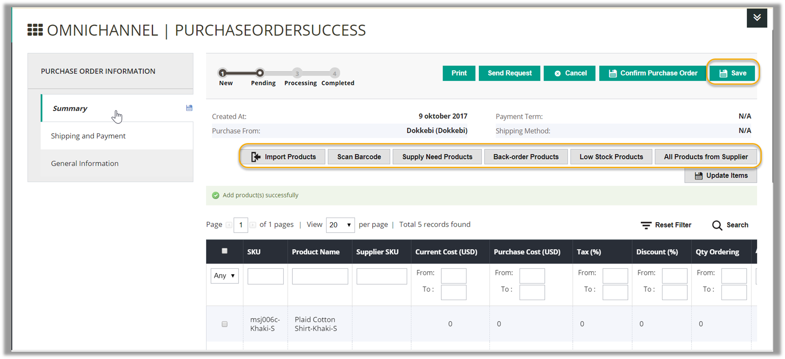

1.  Import Products via a CSV file (a sample file is provided);
2.  Scan Barcode to prepare product (if Barcode Management module is also installed);
3.  Prepare product list based on Supply Need Products forecast. The system will calculate the number of stock that may be in need in an upcoming period based on its sales.
4.  Prepare Back Order Products. Back order products are those that have been ordered by customers but currently not available in stock;
5.  Prepare Low Stock Products. If Inventory Management module is installed, Low Stock products are suggested according to your low stock rules. Select a low stock notification from the drop-down list, then select the products you want to create quotation and click Add Selected Products.
6.  Select products from the list of products from that specific supplier with the All Products from Supplier button.
You can manually enter the Purchase Cost, Tax, Discount and Ordered Qty for each product in the grid. Remember to click Update Items to save your edits.

After enter all required fields, click Save button and Order Totals is automatically calculated.

##### Edit Shipping and Payment method
You can set up Shipping and Payment method for the order:

- Enter the address you want the stock to be shipped to
- Select a shipping method for the quotation
- Estimate and enter the shipping cost
- Set dates when you start the shipment and expect delivery
- Select the payment term
- Choose the method to send order: N/A, Email, Phone, Fax, Vendor website

At this time, you can choose to **Save** the PO, **Send Request** to the supplier (PO will be sent to the supplier’s email address), **Print, Cancel**.
##### Confirm Purchase Order
To confirm purchase order, click on **Confirm Purchase Order**

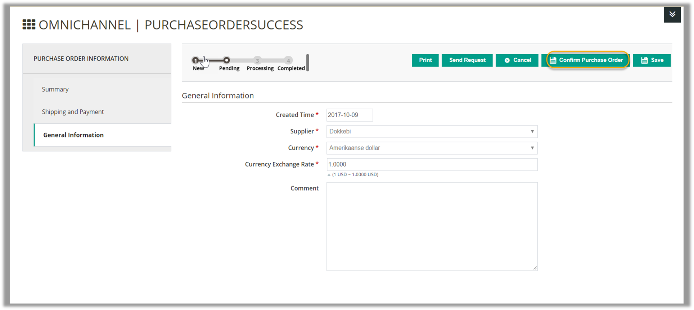

Then you will be able to access 7 following tabs:
1. **Summary** tab:

This tab displays all the PO’s information you have entered in the previous steps. 

2. **Received** Item:

This tab updates how many of each product in the PO you have received. You can mark all items as received, or manually do that for some products. If you have installed the Barcode Management module, you can also enter the product’s barcode and update its delivery status.

3. **Returned** Items:

This tab records all products in the PO which you have returned to the supplier. Please note that you can only return products which you have received.

A Return Items window will appear. Enter the date of return, select product(s) to be returned, type in the quantity to be returned and finish by clicking Return.

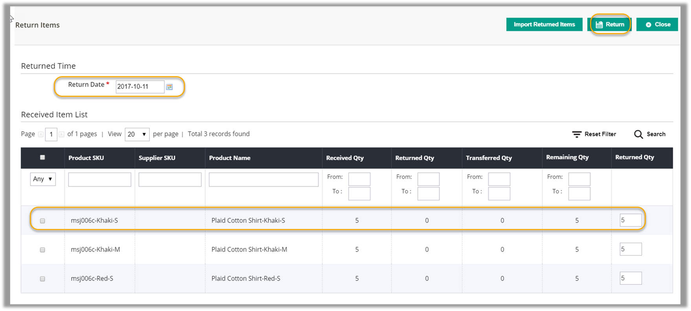

4. **Invoices** tab:

This tab allows you to create invoice for the PO including payment and refund amount.

A Create an Invoice window will appear. Enter the date of creating the invoice; select product(s) to be invoiced; type in the quantity to be billed, unit price (if different), tax and discount in percentage and finish by clicking **Save**.

5. **Transferred Item** tab:

This tab shows the items delivered to a specific warehouse. Please note that you can only transfer products which you have received.

 

A Transfer Items window will appear. Enter the date of transferring; choose the warehouse to transfer products to; select product(s) to be transferred; type in the quantity to be transferred and finish by clicking **Transfer**.

6.  **Shipping and Payment** tab: views and edits shipping and payment information for the PO which you may have input in creating the PO.
7.  **General Information** tab: displays the General Information that you input when creating the PO.
##### Complete Purchase Order

During the process of Confirm Purchase Order, you can complete the purchase order any time by clicking the **Complete PO** button at the right of the page. You can also **Print, Send Email, Cancel** or **Save** the PO during the process.

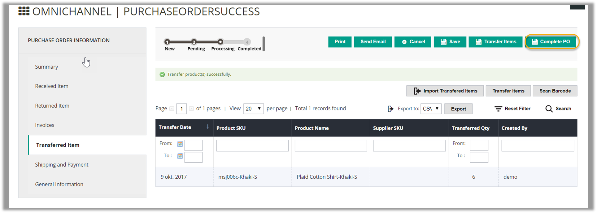

You can complete a purchase order even when you have not received all requested items. When the purchase order status is completed, you cannot receive items anymore but you can still transfer received items into warehouses by clicking on **Transfer Items**

#### Manage Purchase Orders

To create/ edit purchase orders, manage deliveries from suppliers to warehouses and return items from warehouses to suppliers, go to **Purchase Management > Purchase Order > Purchase Order**. The Manage Purchase Orders page contains information related to all POs including **Reference Number, Date of the PO, Supplier, Ordered Qty, Received Qty, Billed Qty, Total Paid, Grand Total inclusive Tax** (i.e. the total value of the PO) and **Status**. 

There are 3 types of Status indicating to which stage the PO has been processed:
- **Pending**: when you have input General Information and prepared product list;
- **Processing**: when you click the Confirm Purchase Order button;
- **Completed**: when you click the Complete PO button.

Click on view a PO to see more details of the PO and you can continue editing the PO.

#### Generate Purchase Order from Quotation
If you want to generate Purchase Order from Quotation, please go to **Purchase Management > Quotation> Quotations**, click to choose a pending quotation. Then choose **Convert Quotation to PO** button.

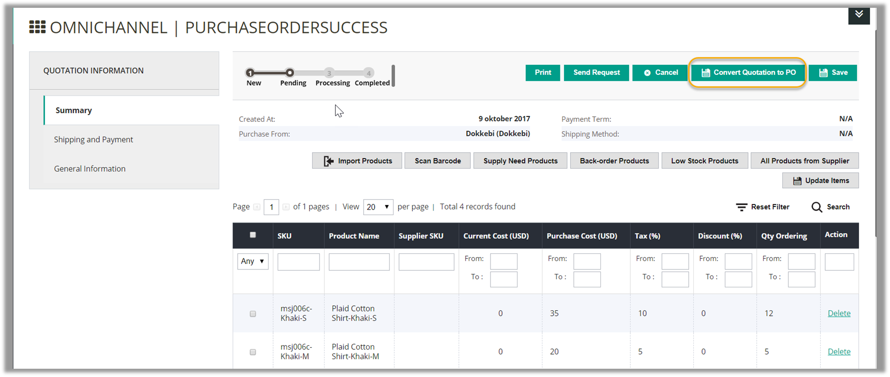

After that, a new purchase order is generated. Now you can:
- Edit Shipping and Payment method
- Confirm Purchase Order
- Complete Purchase Order

----------------

Confidential Information Notice 

Copyright 2017. All Rights Reserved. Any unauthorized reproduction of this document is prohibited. 

This document and the information it contains constitute a trade secret of Magestore and may not be reproduced or disclosed to non-authorized users without the prior written permission from Magestore. Permitted reproductions, in whole or in part, shall bear this notice.

