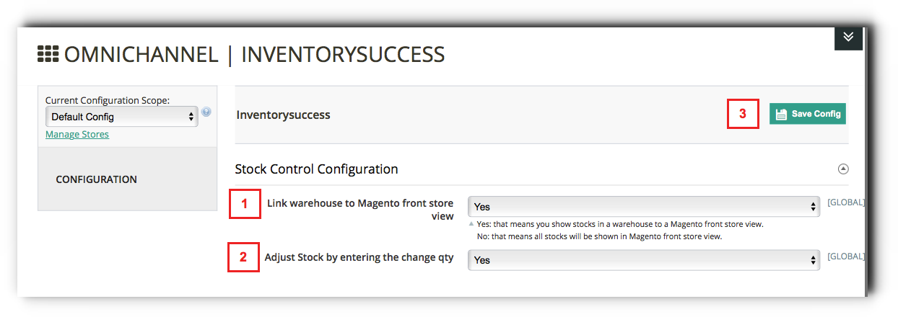
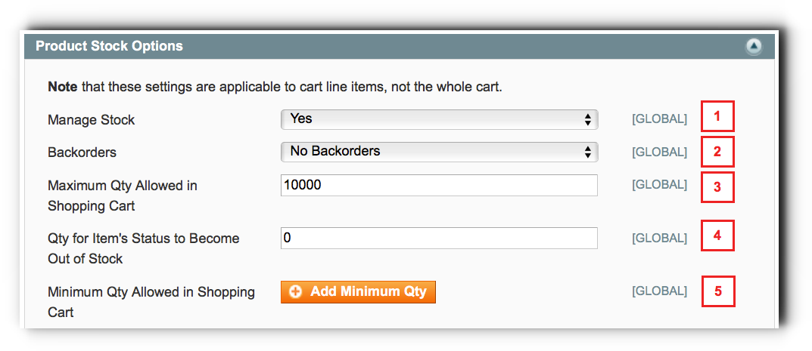
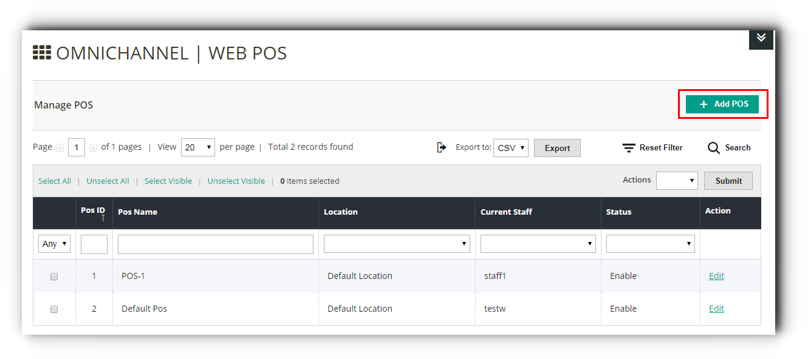
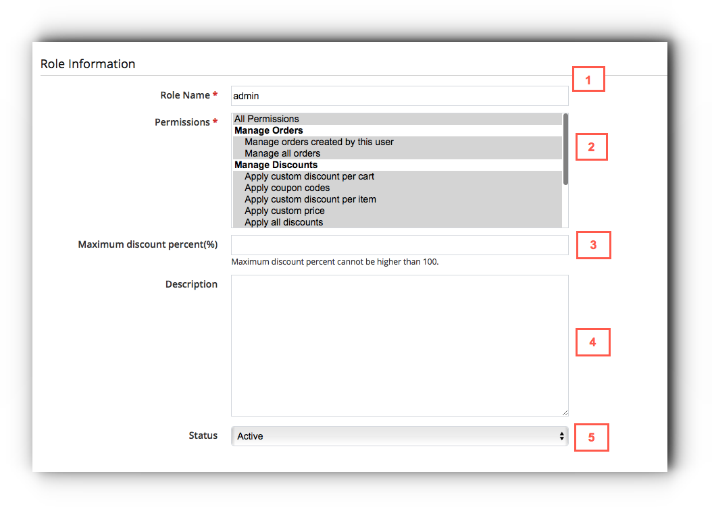
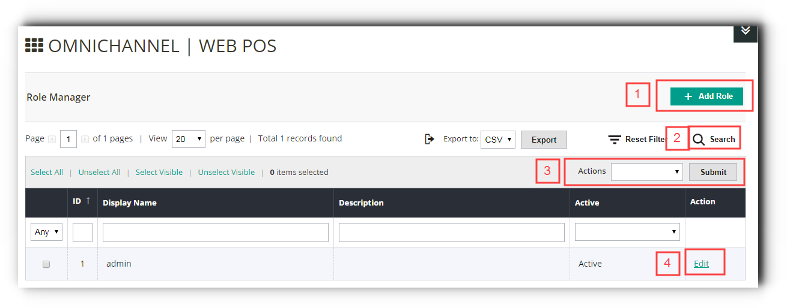
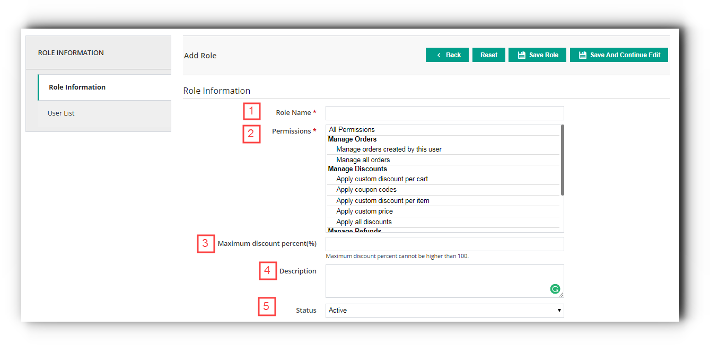
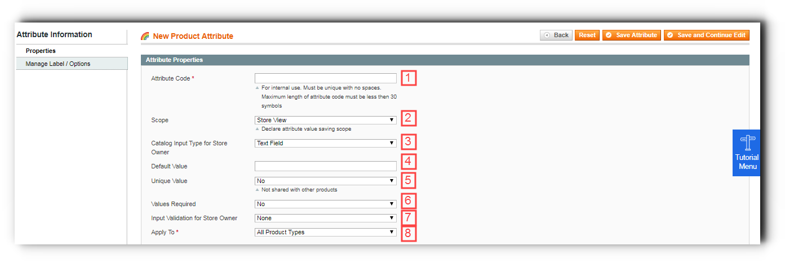

# OMNICHANNEL SOLUTION STARTER PACKAGE - USER GUIDE FOR MAGENTO 1

-------------

## INTRODUCTION

Having seamless integration between **POS (Point of Sale)** and **Inventory Management** brings huge benefits to retailers. Magestore understand this issue deeply. Hence, in our continuous effort to give the best to e-commerce businesses, we offer you an **[Omnichannel Solution] (https://www.magestore.com/omnichannel-retail) - Starter package for Magento 1**. This product is tailor-made for online-to-offline retailers with one single warehouse which includes 2 essential functions i.e. POS and In-stock Management. 

In this detailed user guide, we’re glad to show you how to use and take advantage of this product. With the latest upgraded version, we hope that you will enjoy and greatly benefit from our solution.

-------------

## HOW TO CONFIGURE

### Inventory
#### Stock Control Configuration

_Path: **Inventory Management > Settings > Stock Control Configuration**_

1. **Link warehouses to Magento front store view**: In managing a Warehouse, you can link Warehouse to a Front Store View (path: **Stock Listing > Warehouses >** Click **View > Warehouse Information** section **> General Information** tab **> Magento Store View** field). Note that you can link a warehouse to one or multiple store views.

* If you enable **Link warehouse to Magento Front Store View** by choosing **Yes** here, stock in warehouse will be displayed on the linked store view. When customers buy on this store view, stock quantity will be deducted from this linked warehouse.

* If choose **No**, stocks in all warehouses will be shown on the store view. 

2. **Adjust Stock by entering the change qty**: 

* if you choose **Yes**, when you enter the difference quantity (either a positive or negative figure), the system will calculate the final balance in warehouse by adding/ subtracting the entered value.

* If you choose **No**, you need to enter the exact quantity of stock in warehouse and the system will recognize this figure as the latest available quantity of product.

3. Click **Save Config** to finish

#### Inventory Option

##### Stock Options

_Path: **System > Configuration > Catalog** section **> Inventory > Stock Options**_

1. **Decrease Stock When Order is Placed**: Select **Yes** in the dropdown list to adjust the quantity on hand when an order is placed.
2. **Set Items’ Status to be In Stock When Order is Cancelled**: Select **Yes** in the dropdown list to return items to stock if an order is cancelled.
3. **Display Out of Stock Products**: Select **Yes** in the dropdown list to display products in the catalogue that are no longer in stock. 
4. **Only X left Threshold**: Enter the number in the blank to display the message: **Only x left** on website when the quantity in stock reaches the threshold.  
5. **Display products availability in stock in the frontend**: Select **Yes** in dropdown list to display an **In Stock** or **Out of Stock** message on the product page.
6. Tap **Save Config** to finish

##### Product Stock Options

_Path: **System > Configuration** section **> Catalog > Inventory > Product Stock Options**_

1. **Manage Stock**: Select **Yes** to activate inventory control for your catalog. 

2.	**Backorders**: Backorder is an order for a product that is temporarily out of stock with the supplier. Set Backorders to one of the following status: 

*	**No Backorders**: To reject backorders when product is out of stock.

*	**Allow Qty. Below 0**: To accept backorders when the quantity falls below zero. 

*	**Allow Qty. Below 0 and Notify Customer**: To accept backorders when the quantity falls below zero, and notify the customer that the order can still be placed.

3. **Maximum Qty Allowed in Shopping Cart**: Enter the **Maximum Qty.** allowed in Shopping Cart

4. **Qty for Item’s Status to Become Out of Stock**: Enter the quantity for Item's Status to become out of stock.

5. **Minimum Qty Allowed in Shopping Cart**: Enter the **Minimum quantity** allowed in Shopping Cart.

Next,

6. **Notify for Quantity Below**: Enter the stock level that generates notification showing the item is out of stock.

7. **Enable Qty Increments**: Select **Yes** to activate quantity increments for the product. Then in the **Qty. Increments** field, enter the number of the items that must be purchased to meet the requirement mentioned above.

8. **Automatically Return Credit Memo Item to Stock**: Select **Yes** to return the item to inventory by default when a credit memo is issued for the item.

Finally, click on **Save Config** to save changes. 

### Web POS

#### Add New POS and Assign it to Cashier

##### Create New POS

_Path: from **Magento backend > Sales > Web POS** section **> Manage POS**_

Click on **Add POS** button, then you will be linked to the New POS site 

There are 3 tabs to manage: **POS Information, Closed Session, Current Sessions Detail**

**•	Pos information**

1.	**Pos Name**: POS’s Name
2. **Location**: POS’s location. Note that multiple POS can link to one location. Here, admin can choose location created and mapped to Warehouse. As a result, admin can control both Warehouse and Location easily. 
3. **Current User**: User is working on POS 
4. **Status**: users can **Enable** or **Disable** this POS

**•	Closed Session**

This section will display the statistics of Closed Session after staff working days like this picture above 

**•	Current Sessions Detail:** 

This section will show users detailed statistic of Current Session such as **Opening Balance** (the amount of money when staffs started their shifts), **Theoretical Closing Balance, Real Closing Balance**…

But with the brand new POS, no data is available to display.

##### Assign New POS to Cashier

_Path: **Sales > Web POS** section **> Web POS Permission > POS Users**_

Here you can assign several POS to a staff

#### Manage POS Users & POS Roles 

#####	Decentralize POS Users 

_Path: from **Magento backend > Sales > WebPOS > Web POS Permissions > POS Users**_

###### Edit existing POS Users 

Users can click on **Edit** to view and change the POS users’ data. Then, 2 sections will be displayed which are **User Information** and **User Settings**

**•	User Information**

In this field, users can change user name, password, display name, email address as well as PIN code required when staffs opened new session. 

**•	User Settings**
 

1. **Monthly Target Budget**: KPI each month for this user
2. **Customer Group**: admin can select among those choices 
3. **Locations**: choose the place where this staff is working 
4. **POS**: the POS which this staff is working with 
5. **Role**: Position of this staff 
6. **Status**: admin selects **Enable** to activate this staff account on system or selects **Disable** to prevent him/her from accessing POS

###### Add New POS Users 

Click **Add User** on the right side of the screen.

2 sections, which are **User information** and **User settings**, will be displayed for admin to fill in data – the same as when you Edit an Existing POS User above.

##### Decentralize User Roles 

_Path: **Sales > WebPOS** section **> Web POS Permission > For Roles**_

###### Edit and Adjust Existing Roles on System

After following this path, a home screen listed different roles on system will be appear like the picture below

For example, in this picture, the only one role being active on the system is admin. 

Click on **Edit** under **Action** column to change the decentralization for this role. 

After clicking on **Edit**, you can edit user role in 2 tabs: **Role information** and **User list**

•	**Role Information** tab
 

1. **Role Name**: you could change the name of role if it were essential 
2. **Permissions**: Click to decentralize permission for this role. Hold Shift + Click to select multiple. 
3. **Maximum discount percent**: the highest rate of discount which this role could apply for customers. 
4. **Description**: this field is optional. You can write some words to help your staffs know more about position description
5. **Status**: Select **Active** to active this role or select **Inactive** to limit all the permissions you set.

•	**User List** tab
 

The list of users on the system who have this role 

For example, as we can see on the screenshot, user names **Test1, Albert & Demo** have the same role as **admin** on this system. 

###### Add New Role On System 

Click on **Add Role** button. Then, fill in the role’s information in **Role Information** tab just like above. Then click **Save Role** to apply the changes.

#### Differentiate Access Permission

_Path: **Sales > Web POS** section **> Web POS Permission > POS Roles**_ 

Please refer to **<a href="#decentralize-role">Decentralize User Roles</a>** for detailed instruction.

#### General Settings

*	**Web POS Logo**: Upload your own logo here. Notice that the recommended size is 250x250px and supported files are jpg, png.

*	**Web POS Color**: Users can choose any colors they like and adjust them freely 

*	**Enable Delivery Date**: displays a field allowing cashier can input the date when customers receive products

*	**Allow to sync orders of out-of-stock items**: Choose between Yes or No

*	**Session Timeout**: After this period of time, users need to log in again to continue using POS account (please input the time in second) 

*	**Intergrate with Pole Display device**: Choose **Yes** or **No**. 

*	**Need to confirm before deleting order (App only)**: This setting is only applicable for [RetailerPOS](https://www.magestore.com/retail-pos/) – our POS version for ipad/tablet. Choose Yes or No

*	**Need to create session before working**: Select **Yes** or **No**. Sessions helps users manage process better when requiring input the amount of cash at the beginning or in the end of session. 

*	**Active key for using App**: This setting is only applicable for RetailerPOS where you can enter the key to start using [RetailerPOS](https://www.magestore.com/retail-pos/)

#### Default Guest Checkout 

_Path: **Sales > Web POS** section **> Settings > Default Guest Checkout**_

Default customer contains information that is used for Guest Checkout or when customer information is not enough, default input data will be filled automatically. 

 
Fill in those fields which you want to use as default data such as **First Name, Last Name, Street, Country, State/Province, City, Zip Code, Telephone or email**. 

After filling in, don’t forget to click **Save Config** button to save your changes

#### Enable Payment Method 

_Path: **Sales > Web POS** section **> Settings > Payment for POS**_

There are 3 sections to configure: The first one is **General Payment Setting** and others are **Integration** (for [RetailerPOS App](https://www.magestore.com/retail-pos/) – our POS version for ipad/tablet only which you can skip for this Starter package)

•	**General Payment Setting**
1. **Applicabale Payments**: users can select **Allowed all payment methods** or **Specific Payments**. The latter selection means that your system will only accept some methods which are listed in the field **Specific Payments** below
2. **Specific Payments**: users can choose among those choices such as **Cash On Delivery, Cash In, Credit Card**. Hold **Shift + Click** to select more than one method. These options are only available here when you enable them in **System > Configuration > Sales** section **> Payment Method**
3. **Default Payment Method**: select the option that will appear automatically in the field of payment method when cashiers checkout for customers. 

•	**Paypal Integration (App only)** and **Authorizenet Integration (App only)**: include settings for Paypal, Stripe or Vantiv for [RetailerPOS App](https://www.magestore.com/retail-pos/) – our POS version for ipad/tablet only which you can skip for this Starter package

#### Set up Shipping Method 

_Path: **Sales > Web POS** section **> Settings > Shipping for POS**_

 
•	**Offiline Shipping Methods**: users can choose among those options: **Flat Rate, Free Shipping, Custom Method**. These options are only available here when you enable them in **System > Configuration > Sales** section **> Shipping Method**
•	**Default Shipping Method**: Choose the shipping method that you would want to set as default payment method during checkout WebPOS.

#### Configure Product Search

_Path: **Sales > Web POS** section **> Settings > Product Search**_
 

1. **Product Attributes for Search**: Select attributes by which you want to search products. The default attributes are **Name** and **SKU**. Users can choose among those selections. Hold **Shift +Click** to select more than one 
2. **Barcode Attributes**: Choose SKU to search products quickly (only applicable if you have a barcode attribute which you can skip in this Starter Package). 
3. **Show inactive categories**: Select **Yes** or **No** to display inactive categories in WebPOS frontend.

#### Set Up Default Email 

This configuration includes 4 types of email relating to 4 different process i.e. **Orders, Invoices, Shipments** and **Credit Memos**

 
This section of configuration allows you to send customers automatic email to confirm orders, receive invoices, confirm shipment as well as credit memos.

#### Receipt Printing Configuration

There are 3 parts to configure which are: **General, Content, Optional Fields**
 

1. **General**: users can select **Yes** or **No** to active the function which is printing automatically receipt after an order is successfully placed.

2. **Content**: here you can customize the content of the receipt. 
* Users can choose default font of text
* Header Text: Please fill in the content which you want to appear in the heading section
* Footer Text: Type the content which you want to appear in the footer section 

3.	**Optional Fields**

 
Users can select between **Yes** or **No** to show those items such as Web Pos Logo, Cashier Name, Comment or Barcode. 

#### How Web POS works with Peripheral Device 

Magestore Web POS module can connect with **Barcode Readers, Card Swipers and Receive Printers**

*	**Barcode Readers**: are any devices which can connect with Ipad/Laptop/PC (including USB Port, Wifi or Bluetooth). The scanner reads barcodes and fill encoded information into Web POS search box 
*	**Card Swipers**: only devices connected through USB port (Supports Authorize.Net & Stripe) 
*	**Receive Printers**: any devices connecting with Ipad/Laptop/PC

## HOW TO MANAGE USER PERMISSION

**Note**: Only admin accessing Web POS can set up Staff permission

### How to manage User Roles and Users

**Note**: Users are the one who get permission to access in the Backend

#### Decentralize User Roles

_Path: **System > Permission** section **> Roles**_

##### Manage user role

 
1. Click **Add New Role** to create new user role.

2. Fill out the blank with a value to search, after click **Search**.

3. Search user role information with keyword.

View or edit a role’s detail by clicking on each line.

##### Create a new user role

 
Click **Add New Role**
 

In tab **Role Info**, fill in all required fields including role name and admin password.
 
 
 
In tab **Role Resources**:

1. **Resource Access**: You can choose **Custom** or **All**. Choose **All** if you want users having this role will have access to all resources, click on **Save** or **Save And Continue Edit** button to save your work.
2. If you choose **Custom**, you can tick to assign specific permissions for that role.
3. Click **Save** to complete the process.

#### Decentralize Users

_Path: **System > Permission** section **> Users**_

##### Manage user

 
 
1. Click **Add New User** to create new user.
2. Fill out the blank with a value to search
3. Click on **Search** button to search user information with keyword.

View or edit a user’s detail by clicking on each line.

##### Create a new user
 
  
 
To create new user, click **Add New User**
 
 

In tab **User Info**, fill in the required information.
 
 

In tab **User Role**, select a role for user. Then click **Save User** to complete the process

### How to manage POS staff

#### Decentralize access permission of Web POS users

_Path: **Sales > Web POS** section **> Web POS Permissions > POS Roles**_

##### Manage role

 
 
1. **Add Role**: Click to add a new role.
2. **Search**: You can find role information by click it and fill out values.
3. **Action**: If you want to delete a role record, you need choose a role, then select Delete option and click **Submit**.
4. **Edit**: You can view role’s details (edit) by click **Edit**.

##### Add a new role
 
 

Click **Add Role** to add a new role.

 
 
In **Role Information** tab, fill out the blank.

1. **Role Name**: Enter a name for the role. (required)
2. **Permissions**: Choose **All Permissions** if you want the user to have access to all resources. Or select a specific role. Hold **Ctrl + Click** to select multiple.
3. **Maximum discount percent (%)**: Limit the highest discount percent that each user role can offer customers.
4. **Description**: Enter text that describes the role.
5. **Status**: select **Active** to activate this role.

Then, click on **Save Role** or **Save and Continue Edit** to save your changes.

#### Decentralize POS user

##### Manage User

_Path: **Sales > Web POS** section **> WebPOS Permissions > POS Users**_

 
 
1. Click **Add User** to create a new user.
2. Click **Filters** to search user information.
3. If you want to Delete or Change status a staff, first select a staff, then choose **Delete** or **Change status** and click **Submit**.

Click **Edit** under **Action** column to view a staff’s details or edit.

##### Create a new user

_Path: **Sales > Web POS** section **> WebPOS Permissions > POS Users**_

 
 
Click **Add User**.

 
 
Fill out all the required fields including: **User Name, Password, Password Confirmation, Display Name, Email Address**. The **PIN Code (App only)** setting is only applicable to RetailerPOS – our POS version for ipad/tablet which you can skip in this Starter package user guide.

 
 
1. **Monthly Target Budget**: set the monthly target for the user
2. **Customer Group**: choose the group for the customer from the list
3. **Location**: Assign a Location for the user.
4. **POS**: Assign POS for the user.
5. **Role**: choose the user’s role
6. **Status**: You can Enabled or Disabled this staff.

Finally, click **Save** to complete the process.

## HOW TO MANAGE MASTER DATA

### Product

#### Attribute

_Path: **Catalog > Attributes** section **> Manage Attributes**_

##### Manage Attribute 

 
 
1. Click **Add New Attribute** to create new user.
2. Number of products to be display per page 
3. Search attribute information with keyword.

You can view or edit attribute’s details by clicking on each line

##### Create A New Attribute 

Attributes can be created while working on a product, or from the Product Attributes pages. The following example shows how to create attributes from the Stores menu. Any attribute that is used as a drop-down list of values for a configurable product must have the following properties:

| Property |	Value |
| --- | --- |
| Catalog Input Type for Store Owner	| Dropdown| 
| Scope	| Global |

  
 
Click **Add New Attribute**
 
###### Properties tab:

  

**•	Attributes Properties**

1. Enter a unique **Attribute Code** in lowercase characters, and without space
2. Set **Scope** to indicate where in your store system the attribute can be used
3. Set **Catalog Input Type** for Store Owner to the type in input control to be used for data entry
4. Enter a **Default Label** to identify the attribute
5. If you want to prevent duplicate values from being entered, set **Unique Value** to **Yes**
6. Select Yes to require the customer choose an attribute value option
7. To run a validity test of any data entered in the text field, set **Input Validation for Store Owner** to the type of data that the field should contain. This field is not available for input types with values that are selected. The test can validate any of the following:
* _Decimal Number_
* _Integer Number_
* _Email_
* _URL_
* _Letters_
* _Letters (a-z, A-Z) or Numbers (0-9)_
8. Select if the attribute setting is applied to all product types or only selected type(s). Hold Ctrl + Click to select multiple 

**•	Storefront Properties**

 
 
1. If the attribute is to be available for search on website, set **Use in Quick Search** to **Yes** 
2. If the attribute is to be available for advanced search tool on website, set **Use in Advanced Search** to **Yes**
3. To include the attribute in Product Compare, set **Comparable on Frontend** to **Yes**

For dropdown, multiple select and price fields, do the following: 

4. To use the attribute as a filter in layered navigation, set **Use in Layered Navigation** to **Yes**
5. To use the attribute in layered navigation on search results pages, set **Use in Search Results Layered Navigation** to **Yes**
6. Set **Use for Promo Rule Conditions** to **Yes** to use the attribute in price rule.
7. In the **Position** field, enter a number to indicate the relative position of the attribute in the layered navigation block.
8. To allow the text to be formatted with HTML, set **Allow HTML Tags on Frontend** to **Yes**. This setting makes the WYSIWYG editor available for the field. 
9. To include the attribute in catalog page listings, set **Visible on Catalog Pages on Storefront** to **Yes**
10. Complete the following settings if supported by your theme:
* To include the attribute in product listings, set **Used in Product Listing** to **Yes**
* To use attribute as a sort parameter for product listings, set **Used for Sorting in Product Listing** to **Yes**

###### Manage Labels / Options
 
  
 
In tab **Manage Labels**: Enter a **Title** to be used as a label for the field. If your store is available in different languages, you can enter a translated title for each view.

  
 
When complete, click **Save Attribute** or **Save and Continue Edit**.

