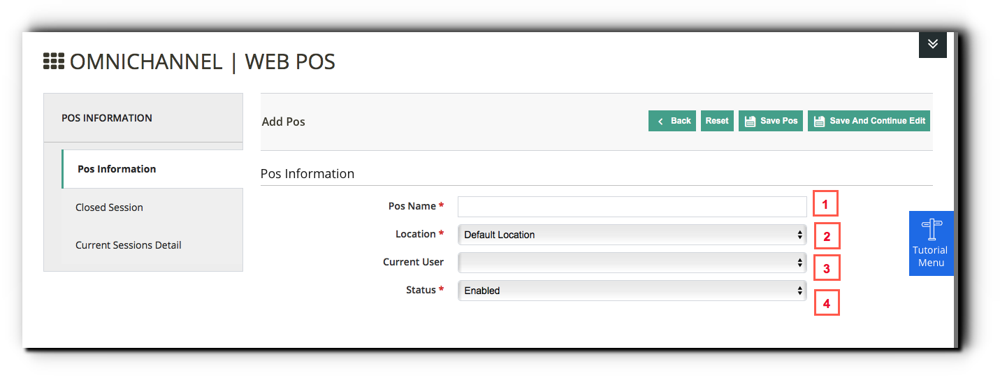
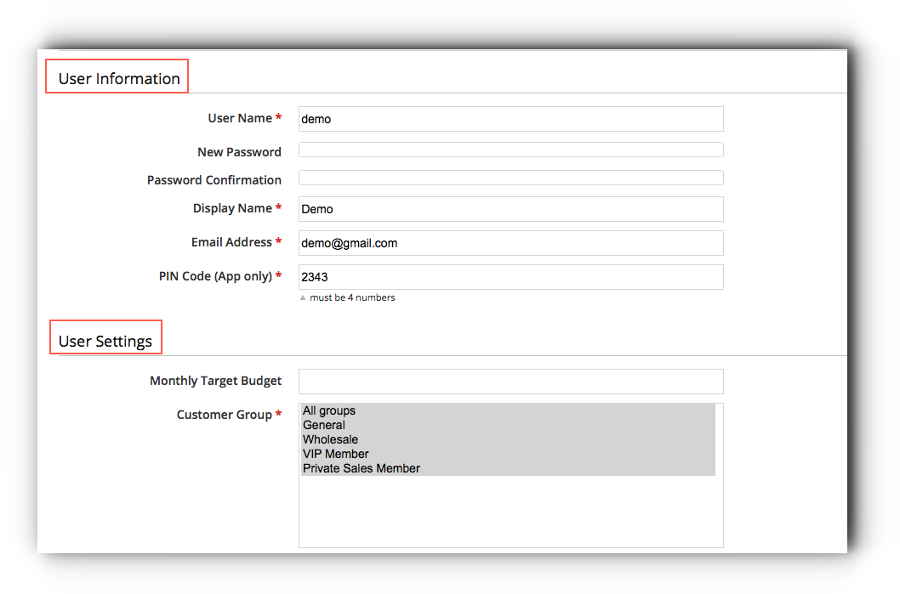
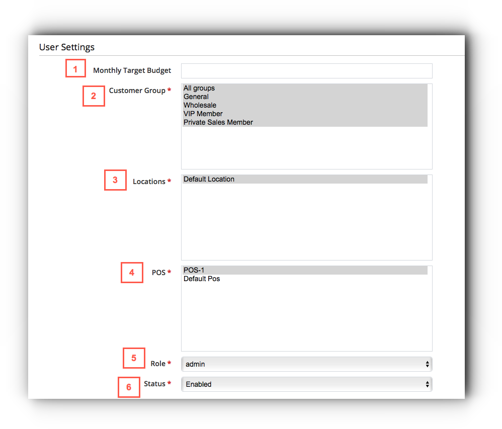
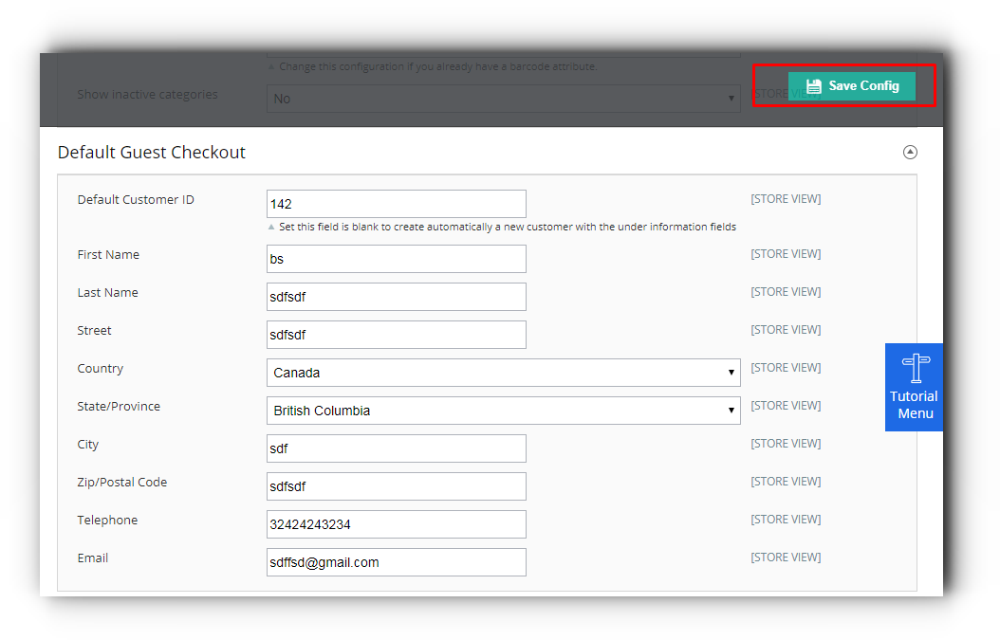
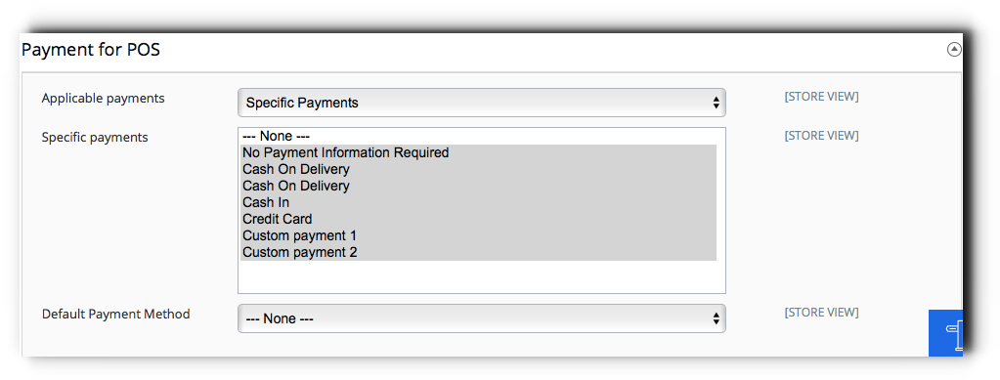

# OMNICHANNEL SOLUTION STARTER PACKAGE - USER GUIDE FOR MAGENTO 1

-------------

## INTRODUCTION

Having seamless integration between **POS (Point of Sale)** and **Inventory Management** brings huge benefits to retailers. Magestore understand this issue deeply. Hence, in our continuous effort to give the best to e-commerce businesses, we offer you an **[Omnichannel Solution] (https://www.magestore.com/omnichannel-retail) - Starter package for Magento 1**. This product is tailor-made for online-to-offline retailers with one single warehouse which includes 2 essential functions i.e. POS and In-stock Management. 

In this detailed user guide, we’re glad to show you how to use and take advantage of this product. With the latest upgraded version, we hope that you will enjoy and greatly benefit from our solution.

-------------

## HOW TO CONFIGURE

### Inventory
#### Stock Control Configuration

_Path: **Inventory Management > Settings > Stock Control Configuration**_

1. **Link warehouses to Magento front store view**: In managing a Warehouse, you can link Warehouse to a Front Store View (path: **Stock Listing > Warehouses >** Click **View > Warehouse Information** section **> General Information** tab **> Magento Store View** field). Note that you can link a warehouse to one or multiple store views.
... •	If you enable **Link warehouse to Magento Front Store View** by choosing **Yes** here, stock in warehouse will be displayed on the linked store view. When customers buy on this store view, stock quantity will be deducted from this linked warehouse.
... •	If choose **No**, stocks in all warehouses will be shown on the store view. 
2. **Adjust Stock by entering the change qty**: 
... •	if you choose **Yes**, when you enter the difference quantity (either a positive or negative figure), the system will calculate the final balance in warehouse by adding/ subtracting the entered value.
... •	If you choose **No**, you need to enter the exact quantity of stock in warehouse and the system will recognize this figure as the latest available quantity of product.
3. Click **Save Config** to finish

#### Inventory Option

##### Stock Options

_Path: **System > Configuration > Catalog** section **> Inventory > Stock Options**_

1. **Decrease Stock When Order is Placed**: Select **Yes** in the dropdown list to adjust the quantity on hand when an order is placed.
2. **Set Items’ Status to be In Stock When Order is Cancelled**: Select **Yes** in the dropdown list to return items to stock if an order is cancelled.
3. **Display Out of Stock Products**: Select **Yes** in the dropdown list to display products in the catalogue that are no longer in stock. 
4. **Only X left Threshold**: Enter the number in the blank to display the message: **Only x left** on website when the quantity in stock reaches the threshold.  
5. **Display products availability in stock in the frontend**: Select **Yes** in dropdown list to display an **In Stock** or **Out of Stock** message on the product page.
6. Tap **Save Config** to finish

##### Product Stock Options

_Path: **System > Configuration** section **> Catalog > Inventory > Product Stock Options**_

1. **Manage Stock**: Select **Yes** to activate inventory control for your catalog. 

2.	**Backorders**: Backorder is an order for a product that is temporarily out of stock with the supplier. Set Backorders to one of the following status: 
... •	**No Backorders**: To reject backorders when product is out of stock.
... •	**Allow Qty. Below 0**: To accept backorders when the quantity falls below zero. 
... •	**Allow Qty. Below 0 and Notify Customer**: To accept backorders when the quantity falls below zero, and notify the customer that the order can still be placed.

3. **Maximum Qty Allowed in Shopping Cart**: Enter the **Maximum Qty.** allowed in Shopping Cart

4. **Qty for Item’s Status to Become Out of Stock**: Enter the quantity for Item's Status to become out of stock.

5. **Minimum Qty Allowed in Shopping Cart**: Enter the **Minimum quantity** allowed in Shopping Cart.

Next,

6. **Notify for Quantity Below**: Enter the stock level that generates notification showing the item is out of stock.

7. **Enable Qty Increments**: Select **Yes** to activate quantity increments for the product. Then in the **Qty. Increments** field, enter the number of the items that must be purchased to meet the requirement mentioned above.

8. **Automatically Return Credit Memo Item to Stock**: Select **Yes** to return the item to inventory by default when a credit memo is issued for the item.

Finally, click on **Save Config** to save changes. 

### Web POS

#### Add New POS and Assign it to Cashier

##### Create New POS

_Path: from **Magento backend > Sales > Web POS** section **> Manage POS**_

Click on **Add POS** button, then you will be linked to the New POS site 

There are 3 tabs to manage: **POS Information, Closed Session, Current Sessions Detail**

**•	Pos information**

1.	**Pos Name**: POS’s Name
2. **Location**: POS’s location. Note that multiple POS can link to one location. Here, admin can choose location created and mapped to Warehouse. As a result, admin can control both Warehouse and Location easily. 
3. **Current User**: User is working on POS 
4. **Status**: users can **Enable** or **Disable** this POS

**•	Closed Session**

This section will display the statistics of Closed Session after staff working days like this picture above 

**•	Current Sessions Detail:** 

This section will show users detailed statistic of Current Session such as **Opening Balance** (the amount of money when staffs started their shifts), **Theoretical Closing Balance, Real Closing Balance**…

But with the brand new POS, no data is available to display.

##### Assign New POS to Cashier

_Path: **Sales > Web POS** section **> Web POS Permission > POS Users**_

Here you can assign several POS to a staff

#### Manage POS Users & POS Roles 

#####	Decentralize POS Users 

_Path: from **Magento backend > Sales > WebPOS > Web POS Permissions > POS Users**_

###### Edit existing POS Users 

Users can click on **Edit** to view and change the POS users’ data. Then, 2 sections will be displayed which are **User Information** and **User Settings**

**•	User Information**

In this field, users can change user name, password, display name, email address as well as PIN code required when staffs opened new session. 

**•	User Settings**
 

1. **Monthly Target Budget**: KPI each month for this user
2. **Customer Group**: admin can select among those choices 
3. **Locations**: choose the place where this staff is working 
4. **POS**: the POS which this staff is working with 
5. **Role**: Position of this staff 
6. **Status**: admin selects **Enable** to activate this staff account on system or selects **Disable** to prevent him/her from accessing POS

###### Add New POS Users 

Click **Add User** on the right side of the screen.

2 sections, which are **User information** and **User settings**, will be displayed for admin to fill in data – the same as when you Edit an Existing POS User above.

##### Decentralize User Roles 

_Path: **Sales > WebPOS** section **> Web POS Permission > For Roles**_

###### Edit and Adjust Existing Roles on System

After following this path, a home screen listed different roles on system will be appear like the picture below

For example, in this picture, the only one role being active on the system is admin. 

Click on **Edit** under **Action** column to change the decentralization for this role. 

After clicking on **Edit**, you can edit user role in 2 tabs: **Role information** and **User list**

•	**Role Information** tab
 

1. **Role Name**: you could change the name of role if it were essential 
2. **Permissions**: Click to decentralize permission for this role. Hold Shift + Click to select multiple. 
3. **Maximum discount percent**: the highest rate of discount which this role could apply for customers. 
4. **Description**: this field is optional. You can write some words to help your staffs know more about position description
5. **Status**: Select **Active** to active this role or select **Inactive** to limit all the permissions you set.

•	**User List** tab
 

The list of users on the system who have this role 

For example, as we can see on the screenshot, user names **Test1, Albert & Demo** have the same role as **admin** on this system. 

###### Add New Role On System 

Click on **Add Role** button. Then, fill in the role’s information in **Role Information** tab just like above. Then click **Save Role** to apply the changes.

#### Differentiate Access Permission

_Path: **Sales > Web POS** section **> Web POS Permission > POS Roles**_ 

Please refer to **<a href="#decentralize-role">Decentralize User Roles</a>** for detailed instruction.

#### General Settings

... •	**Web POS Logo**: Upload your own logo here. Notice that the recommended size is 250x250px and supported files are jpg, png.
... •	**Web POS Color**: Users can choose any colors they like and adjust them freely 
... •	**Enable Delivery Date**: displays a field allowing cashier can input the date when customers receive products
... •	**Allow to sync orders of out-of-stock items**: Choose between Yes or No
... •	**Session Timeout**: After this period of time, users need to log in again to continue using POS account (please input the time in second) 
... •	**Intergrate with Pole Display device**: Choose **Yes** or **No**. 
... •	**Need to confirm before deleting order (App only)**: This setting is only applicable for [RetailerPOS](https://www.magestore.com/retail-pos/) – our POS version for ipad/tablet. Choose Yes or No
... •	**Need to create session before working**: Select **Yes** or **No**. Sessions helps users manage process better when requiring input the amount of cash at the beginning or in the end of session. 
... •	**Active key for using App**: This setting is only applicable for RetailerPOS where you can enter the key to start using [RetailerPOS](https://www.magestore.com/retail-pos/)

#### Default Guest Checkout 

_Path: **Sales > Web POS** section **> Settings > Default Guest Checkout**_

Default customer contains information that is used for Guest Checkout or when customer information is not enough, default input data will be filled automatically. 

 
Fill in those fields which you want to use as default data such as **First Name, Last Name, Street, Country, State/Province, City, Zip Code, Telephone or email**. 

After filling in, don’t forget to click **Save Config** button to save your changes

#### Enable Payment Method 

_Path: **Sales > Web POS** section **> Settings > Payment for POS**_

There are 3 sections to configure: The first one is **General Payment Setting** and others are **Integration** (for [RetailerPOS App](https://www.magestore.com/retail-pos/) – our POS version for ipad/tablet only which you can skip for this Starter package)

•	**General Payment Setting**
1. **Applicabale Payments**: users can select **Allowed all payment methods** or **Specific Payments**. The latter selection means that your system will only accept some methods which are listed in the field **Specific Payments** below
2. **Specific Payments**: users can choose among those choices such as **Cash On Delivery, Cash In, Credit Card**. Hold **Shift + Click** to select more than one method. These options are only available here when you enable them in **System > Configuration > Sales** section **> Payment Method**
3. **Default Payment Method**: select the option that will appear automatically in the field of payment method when cashiers checkout for customers. 

•	**Paypal Integration (App only)** and **Authorizenet Integration (App only)**: include settings for Paypal, Stripe or Vantiv for [RetailerPOS App](https://www.magestore.com/retail-pos/) – our POS version for ipad/tablet only which you can skip for this Starter package

#### Set up Shipping Method 

_Path: **Sales > Web POS** section **> Settings > Shipping for POS**_

 
•	**Offiline Shipping Methods**: users can choose among those options: **Flat Rate, Free Shipping, Custom Method**. These options are only available here when you enable them in **System > Configuration > Sales** section **> Shipping Method**
•	**Default Shipping Method**: Choose the shipping method that you would want to set as default payment method during checkout WebPOS.

#### Configure Product Search

_Path: **Sales > Web POS** section **> Settings > Product Search**_
 

1. **Product Attributes for Search**: Select attributes by which you want to search products. The default attributes are **Name** and **SKU**. Users can choose among those selections. Hold **Shift +Click** to select more than one 
2. **Barcode Attributes**: Choose SKU to search products quickly (only applicable if you have a barcode attribute which you can skip in this Starter Package). 
3. **Show inactive categories**: Select **Yes** or **No** to display inactive categories in WebPOS frontend.

#### Set Up Default Email 

This configuration includes 4 types of email relating to 4 different process i.e. **Orders, Invoices, Shipments** and **Credit Memos**

 
This section of configuration allows you to send customers automatic email to confirm orders, receive invoices, confirm shipment as well as credit memos.

