# INVENTORY MANAGEMENT - MAGENTO 2

**Version 1.2.0**

*Confidential Information Notice 
*Copyright2016. All Rights Reserved. Any unauthorized reproduction of this document is prohibited.
This document and the information it contains constitute a trade secret of Magestore and may not be reproduced or disclosed to non-authorized users without the prior written permission from Magestore. Permitted reproductions, in whole or in part, shall bear this notice.*

## INTRODUCTION
------

If your inventory is not enough to supply, you may lose customer. But if the inventory you keep is more than needed, it will cost you lots of money to manage. Thus, it is vital to equip your business with an effective inventory system to always keep your warehouses at an ideal stock level. Magestore team has been working hard to offer you a friendly & affordable stock management solution for Magento 2 with smart design, clean and simple workflow to handle every activity about stock management, stock transfer, stock taking and low stock notification…in your warehouses in the most efficient way. With our newest version, you can:

•	Validate data before submitting send/request stock

•	Allow to add product to multiple warehouses in product edit page

•	Force edit product Qty features

•	Allow to link warehouse to Front Magento Store (link products and stock data)

•	Allow to link multiple Magento stores to a warehouse

Hope that you will have a great time using our extension and free your mind from messy stock management.

## HOW IT WORKS
---

### Stock listing

#### Warehouse

After installation, the system will automatically provide a **Primary Warehouse**. This warehouse cannot be deleted and can only be edited. All the existing products with stocks level of your website will be automatically allocated in this warehouse first before being sent to other warehouses.

A warehouse contains basic information including Total SKU, total Qty, contact email, telephone, street, city, country and status

Admin can add new warehouse then fill all information including warehouse name, contact, country…

#### Manage user/staff & Permission

Permission in Inventory extension allows admin to create multiple users and user roles. A user can be assigned to a warehouses and grant specific access to the specific parts in Inventory management.

- **Create user role**

Go to System menu, select “User Roles” under Permission submenu. Now admin can view a list of role and create a new role for users. Role information contains role info (name & password) and role resource. This role resource contains every part of Inventory that this role can be able to access to. For example if you set this role as Manager, you can grant some important permission to Delete warehouse, confirm Physical stock taking or complete a Stock request…by selecting the check boxes then Save Role.

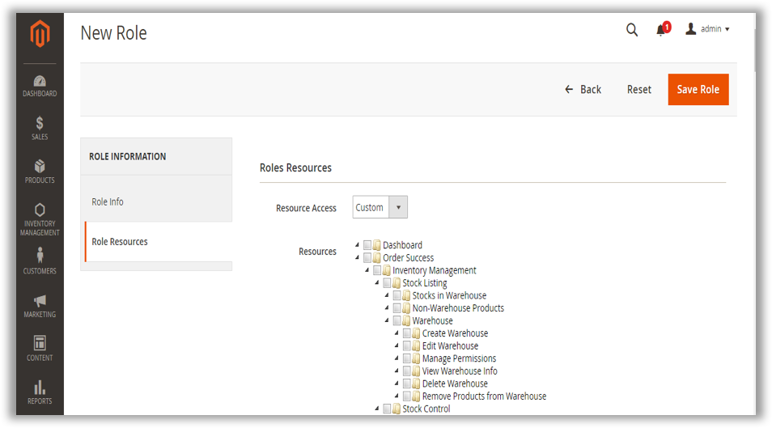

-	**Create new user**
Go to System menu, select “All users” under Permission submenu, admin can view a list of staffs with user name, name, email and status of account. User information contains 3 parts: User Info, User Role and the Warehouse which the user is assigned to. Admin can assign the warehouse and role for a staff. Admin can add new, edit, remove and save staff information.

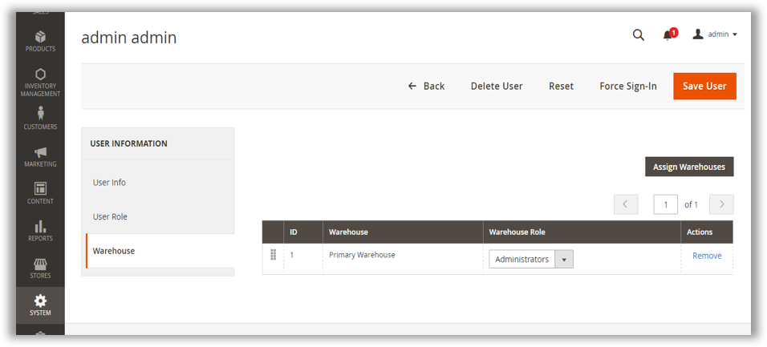

- **Assign staff to warehouse**

Go to Warehouses under Stock Listing submenu then select any warehouse, there is a configuration for Permission. From here admin can assign staff for that warehouse conveniently.

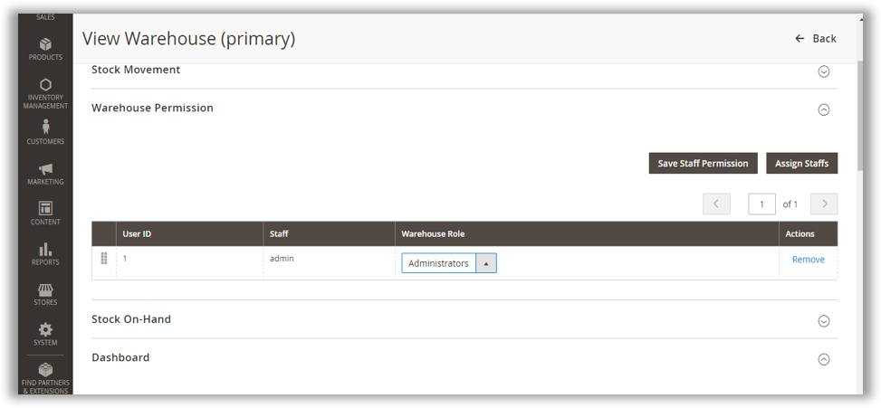

#### Stock in Warehouse

Admin can have overview of Stock in all Warehouses and select a warehouse to view stocks of that warehouse only.

It can show Available Qty, Qty to Ship and total Qty in each warehouse and Shelf Location of that product in the warehouse.

After selecting the warehouse, admin can easily update stock and shelf location right on the Inventory grid just by selecting the products, fill the updated Total Qty/Shelf location and click “Update Stock”.

Moreover, you can easily edit Qty of products by accessing to Products, choose **Catalog**, choose to edit a specific product and tick on **Force Edit**

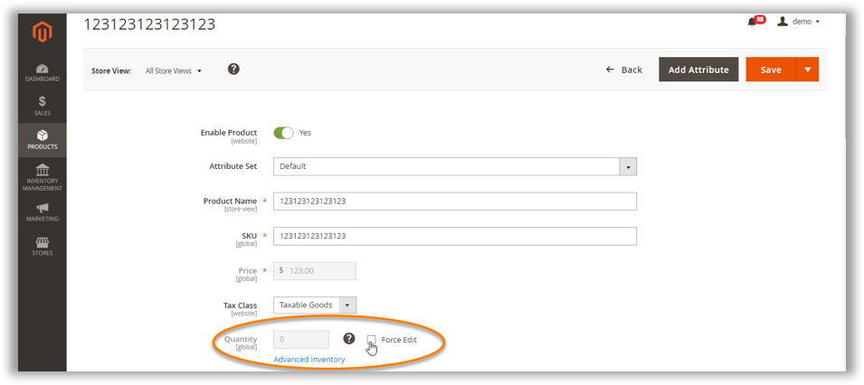

#### Non-warehouse product

When a product is newly created and not assigned to any warehouse yet, it will be automatically allocated in Non-warehouse. From here admin can select the product and add it into a specific warehouse.

In addition, admin can also add the product to multiple warehouses in **Product edit page**:

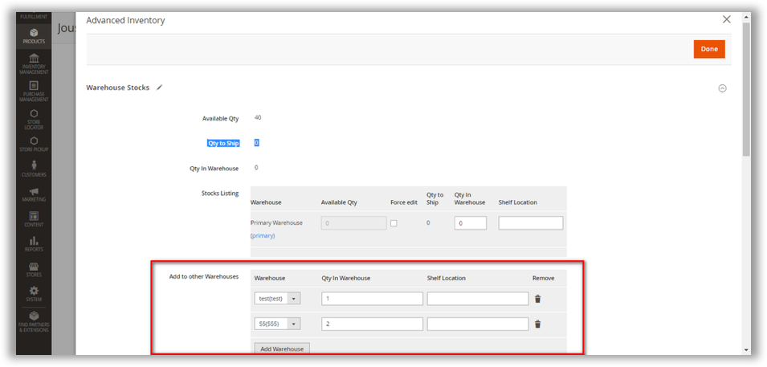

### Prediction

#### Supply Needs

This feature predicts how many inventory items a warehouse need for each product within a future period. The system will calculate this number based on your sales history in the corresponding period in the past. The **Forecast Supply Needs** feature will be automatically shown on the section **Supply Needs** your supply needs is zero. Or else, you can click on **Show Supply Needs** button. Admin can select Base On Sales to use to calculate data for supply need, fill in **Forecast Supply Needs** to the date that you want to get supply needs then it will give a product list with following information:

- Qty Sold/day: average Qty of product sold per day 

- Total Sold: total qty of product that were sold in Base On Sales 

- Current Qty

- Availability date 

- Supply needs

The Supply Need Forecast can be exported to CSV or XML file and printed into PDF file.

#### Low Stock Notification

Low Stock notification listing displays warning messages about the products which are nearly out of stock in warehouses. It shows all notification with information including Sent at, Update Type, Email received, Recipients and Action. Each notification log can show details of all products that have been low stock including Name, SKU, Image, Qty Notified and Time Notified.

#### Low Stock Rule

Admin can create unlimited rules to notify low stock. One rule contains: Rule information, Condition and Action.

-	**Rule information:** You can fill in Rule name, description, status, validation date, time that you want to get notification.

-	**Condition:** There are 2 rule types for you to select: Available Days and Available Qty.

With Available Days selection, the system will base on sales history of an item to predict how many days left till it will be out of stock. You can configure Sales period (history time to base on and get sale data) and Threshold day (the days before the product runs out of stock). So if you configure Threshold day as 5, system will send notification to you 5 days before this item is predicted to be out of stock so that you can prepare to purchase more stocks.

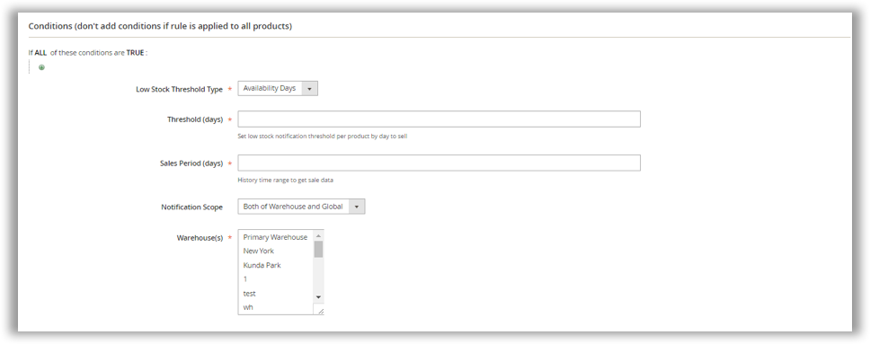

Besides, you can add more conditions about Product attribute for example product SKU, color, category…

-	**Action:** You can fill in the emails that you want to send the low stock notification to and warning message.

### Transfer Stock

#### Send stock & Request stock

**Send stock:** If admin want to send stock from his warehouse to another warehouse, he can use this feature to record stock sending. The process to Send stock is: Add new send stock > Prepare Product list > Send Stock > Receive Stock > Mark as Completed

-	**Add new send stock:** Select the Source warehouse and Destination warehouse. Fill in the reason.

-	**Prepare the product list:** From here admin can import list of product to send or import via CSV file. Then update the qty to send. Click Start send stock to activate sending. You can see stock sending summary and download the summary.

-	**Receive stock:** Destination warehouse can create receives by importing or selecting product then update received qty. Then click Save receive.

Now you can download Shortfall list – the list containing the products that the Destination warehouse does not receive from Source warehouse.

**Request Stock:** If a warehouse lacks of stock, admin can create a Stock request to get stock from other warehouse. The process to request stock is: Add new request stock > Prepare Product list > Request Stock > Delivery Stock > Receive Stock > Mark as Completed

-	**Add new request stock:** Select the Source warehouse and Destination warehouse. Fill in the reason.

-	**Prepare the product list:** From here admin can import list of product to send or import via CSV file. Then update the qty to send. Click Start send stock to activate sending. You can see stock sending summary and download the summary.

-	**Delivery History:** Source warehouse when receive the stock request can create a stock delivery. When a stock delivery is created, stock will be subtracted immediately from the source warehouse.

-	**Receive History:** Destination warehouse can create receives by importing or selecting product then update received qty. Then click Save receive. After that, stock will be added immediately to the destination warehouse from which the stock request was sent.

Now you can download Shortfall list & Summary of the Stock Request.

Moreover, if the number of **Qty** you choose is bigger than the **Qty in Warehouse**, the system will automatically notify you to validate data before submitting send/request stock, as below:

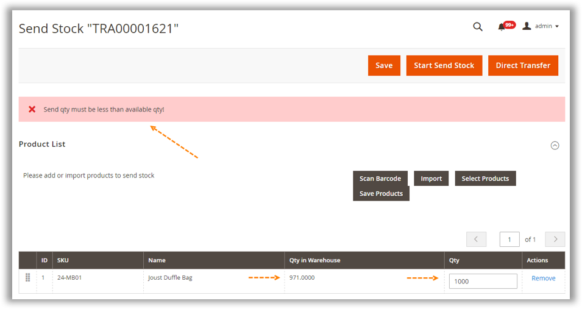

#### Transfer to External & Transfer from External

**-**	**Transfer to External**

This feature allows you to handle the product which is damaged, loss or sent as free gift…You can fill in the External location, select product & Qty to send.

**-**	**Transfer from External**

This feature allows you to accept the stocks from outside of the system. Not from another warehouse but can be from any other source. You can fill in the External location, select product & qty to receive.

#### Transfer Stock History

This History records stock movements from Send stock, request stock, transfer from external and transfer to external.

### Stock Control

#### Stock Adjustment & Stock Adjustment History

**-	Link stocks in Warehouse to Front Store View:**

With the newest version, you can link products and stock data by choosing “Yes” on the **Link stocks in Warehouse to Front Store View** section

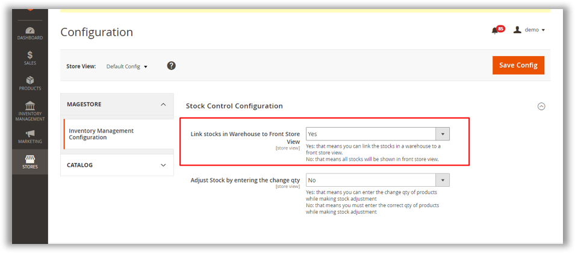

To link multiple Store View to a Warehouse, go to **Inventory Management > Warehouse > select a specific warehouse**. Here, you can change the store view that links to the warehouse or select multiple store views as needed.

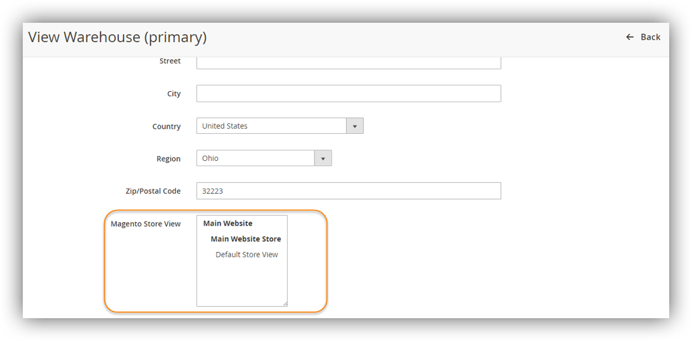

**-	Add new Stock Adjustment**

Under menu “Stock Control”, you can create new Stock Adjustment for a specific warehouse chosen from Drop down list. Fill the reason, then **Start Adjust Stock**.

From here you now go to Product List to **Add products to adjust stocks** or **Import products**, fill in the Qty you want to update and Save the Stock Adjustment. The Qty here can be “Change Qty” or “Adjusted Qty”, depending on how you configure in Store   Configuration: 

If you fill the Change Qty, you are allowed to add or subtract the change by filling positive or negative number. If you fill in Adjusted Qty, you will fill the final calculation to update the final qty. After being saved, this stock adjustment’s status is now **Pending**.

To change Stock Adjustment status to “completed”, you need to hit button “Adjust Stock”. Stock is updated in the warehouse. Once the Adjustment is Complete, there is no way to edit it.

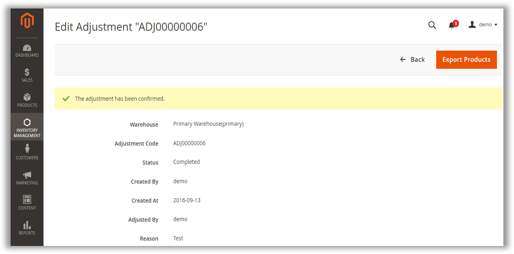

Stock level will be updated instantly in the corresponding warehouse.

**-	View Stock Adjustment History**

You can view all Stock Adjustment History under Stock Control -> Stock Adjustment History with information including Time created, staff created, warehouse and status…Click to each Adjustment, you can see stock adjustment details

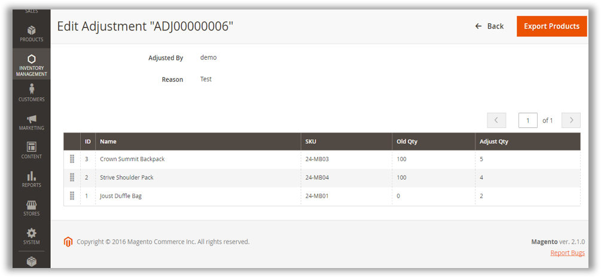

#### Stock Taking & Stock Taking History

Physical Stocktaking acts can be used at any time to double-check and correct inventory discrepancy amounts in Inventory Management vs. physical inventory in your warehouses. These consist of:

-	A count, in which warehouse staff records the actual number of products in stock at the time of inspection & a manager can rely on it to update inventory in the system later

-	Then a confirmation of that count performed by a warehouse manager to officially update the correct number of products in stock (Adjust Stock)

There are 5 steps in Stock taking using Inventory Management:

1.	**Fill General information:** After finishing this step, Stock taking status is **Pending**

2.	**Prepare products before doing stock take:** Select or import products to prepare before doing stock take. Stock taking status will change to **Processing**

3.	**Do Stock take:** Fill in the Qty of product. Now status is changed to **Verified**

4.	**Complete data entry:** Save the data that has been stock taken and waiting for admin’s approval.

5.	**Complete Stock take:** When admin does this, Stock taking status will be changed to Complete. Qty is adjusted in the warehouse. Similar to Adjust Stock, stock taking cannot be edited after status is Complete.
After doing stock take, admin can easily view and export the difference between real stock in the warehouse and the stock level updated by the system

#### Stock Movement

The extension records all the movements of stocks in warehouse. These movements are reflected in Stock Movement report under Stock Control submenu.

The table shows SKU of the products added or subtracted from warehouse, the changed Qty, Warehouse name, Date and Reference number to see the details on a click. Admin can easily exports Stock Movement details into CSV or Excel XML.

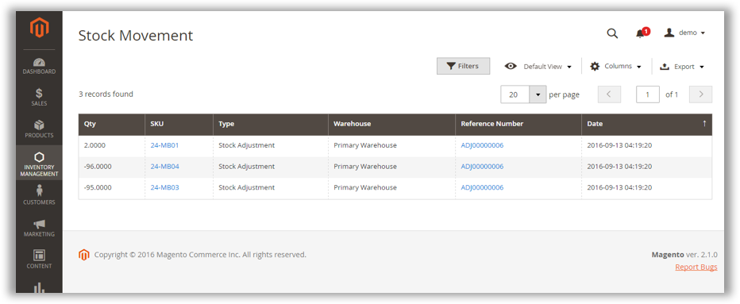

Admin can also filter the data basing on the variables in the table

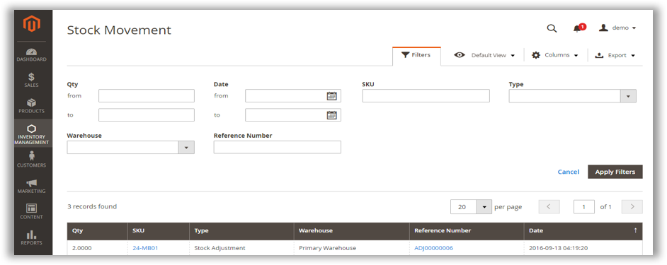
